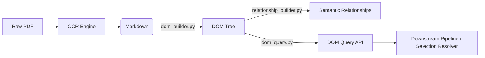

# 🌳 Intelligent DOM Extraction — Integration Guide

> **Target Audience**: Automation Engineers & AI Agents integrating the `dom_learner` into the main IDP pipeline.

This document explains the architecture, approach, and integration points for the **Intelligent DOM Learning Engine** module (`idp_studio/dom_learner`). 

---

## 1. Architectural Context & Goal

Traditionally, data extraction relies on coordinate-based bounding boxes or brittle regex patterns. 

Our goal with this architecture is to move to **Structure-Based Extraction**. 
By converting raw OCR output into a **Logical Document Object Model (DOM)**, the system understands the document hierarchy (Sections → Tables → Rows → Cells) exactly like a browser understands HTML.

### Where this fits in the Architecture
Based on the `Intelligent_DOM_Extraction_Architecture.png`, this module implements **Phase 1: DOM Construction**.



---

## 2. The Approach

### Input: OCR Markdown
The engine takes standard Markdown generated by OCR models (like `marker_model`). It expects standard markdown structures:
* Headings (`#`, `##`, `###`)
* Tables (`| Col | Col |`)
* Paragraphs

### Processing Pipeline
1. **Markdown Parser**: Tokenizes the document line-by-line, stripping OCR HTML artifacts (`<br>`, `<b>`).
2. **Section Parser**: Groups tokens hierarchically based on heading levels.
3. **Table Parser**: Converts markdown tables into structured grids, normalizing column counts.
4. **DOM Builder**: Nests everything into a traversable tree of nodes (`Document`, `Section`, `Table`, `Row`, `Cell`, `Paragraph`, `Note`).
5. **Relationship Builder**: Analyzes the tree and generates 16 types of semantic edges (e.g., `ROW_HAS_LABEL`, `REFERS_TO_NOTE`, `TABLE_IN_SECTION`).

### Output: Navigable Python Object (and JSON)
The primary output is **not** just a JSON file. It is the `DOMQuery` Python object, which allows downstream scripts to programmatically search and traverse the document structure.

---

## 3. How to Integrate (Python API)

To merge this into the main pipeline, your scripts should interact directly with the Python API rather than parsing the JSON outputs manually.

### Step 1: Import and Build the DOM

```python
from pathlib import Path
from automation_engine.modules.idp_studio.dom_learner.engine.dom_builder import DOMBuilder
from automation_engine.modules.idp_studio.dom_learner.engine.dom_query import DOMQuery
from automation_engine.modules.idp_studio.dom_learner.models import NodeType

# 1. Parse the Markdown and build the tree
markdown_path = Path("path/to/ocr_output.md")
builder = DOMBuilder()
document = builder.build(markdown_path)

# 2. Initialize the Query API
q = DOMQuery(document)
```

### Step 2: Extracting Values using Smart Scoring
Because OCR can sometimes misalign rows in large tables (like the P&L statement), the most robust way to find a financial line item is to search the DOM and **score** the matching rows. The DOM faithfully captures detailed note tables (which are usually cleaner than main tables).

Here is the recommended extraction logic to drop into your pipeline:

```python
def _looks_like_number(val: str) -> bool:
    """Helper: Checks if extracted text looks like a financial number."""
    cleaned = val.replace(",", "").replace(".", "").replace("-", "").strip()
    return bool(cleaned and cleaned.isdigit())

def find_best_row_for_variable(q: DOMQuery, label: str):
    """Finds the most reliable row in the DOM for a given line item."""
    label_lower = label.strip().lower()
    
    # 1. Find all candidate rows (either by row label or searching all cells)
    matches = q.find_row(label)
    if not matches:
        cell_matches = q.find_by_text(label, node_type=NodeType.CELL)
        matches = [c.parent for c in cell_matches if c.parent and c.parent.node_type == NodeType.ROW]

    if not matches:
        return None

    best_row = None
    best_score = -999

    for row in matches:
        # Extract the last two numeric cells (typically Current & Previous Year)
        cells = [c for c in row.children if c.node_type == NodeType.CELL]
        fy25, fy24 = "", ""
        
        numeric_cells = []
        for cell in cells:
            text = cell.text.strip()
            if _looks_like_number(text):
                numeric_cells.append(cell)
        if len(numeric_cells) >= 2:
            fy25 = numeric_cells[-2].text.strip()
            fy24 = numeric_cells[-1].text.strip()

        score = 0
        if fy25 and fy24:
            score += 10
            # Heavily penalize OCR garbage (e.g., dots instead of commas)
            if "." in fy25 or "." in fy24:
                score -= 5
            # Heavily penalize matches that are actually date headers
            if "march" in fy25.lower() or "march" in fy24.lower():
                score -= 50

        # Reward aggregated/clean rows (Total / Net) found in Note tables
        row_text = row.text.lower()
        if label_lower == row_text or f"| {label_lower}" in row_text:
            score += 5
        elif f"total {label_lower}" in row_text:
            score += 8
        elif f"{label_lower} (net)" in row_text:
            score += 8

        if score > best_score:
            best_score = score
            best_row = row

    return best_row

# Example Usage:
row = find_best_row_for_variable(q, "Revenue from operations")
if row:
    print(f"Found in Section: {row.section.text if row.section else 'N/A'}")
    print(f"Structural Path: {q.get_structural_path(row)}")
```

---

## 4. Understanding the Data Models

If you need to traverse the nodes manually, here is how the data is structured. 
All nodes (`SectionNode`, `TableNode`, `RowNode`, `CellNode`) inherit from `DOMNode`.

**Useful Node Properties:**
* `node.parent`: The parent node.
* `node.children`: List of child nodes.
* `node.previous_sibling` / `node.next_sibling`: Navigate adjacent rows/cells.
* `node.section` / `node.table`: Instantly jump up to the parent section or table.
* `node.metadata`: Dictionary pre-wired for future OCR coordinates (`bbox`, `page`, `confidence`).

---

## 5. Summary for AI Agents (Antigravity)

When integrating this code:
1. **Do not parse `logical_document_tree.json` manually** unless you are debugging or rendering a UI. 
2. Use the `DOMQuery` class instantiated via `DOMBuilder`.
3. Rely on `q.find_row()`, `q.find_cell()`, and `q.get_structural_path()` to locate data.
4. If extracting financial numbers, use the scoring heuristic provided above to automatically resolve conflicts between misaligned OCR tables (e.g., P&L) and perfectly aligned Note tables.
