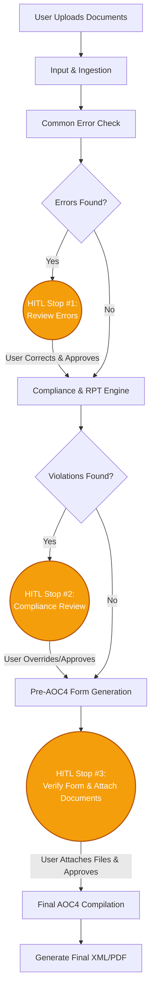

# AOC4 Generation Module Workflow & Architecture

This document outlines the proposed architecture and workflow for building the AOC4 module. Based on your description, the process is highly stateful and requires multiple Human-in-the-Loop (HITL) interventions. We will need to design a system that can pause backend execution, wait for user review/edits, and then resume the workflow.

## User Review Required

> [!IMPORTANT]
> Please review the workflow stages below and confirm if the sequence perfectly matches your expectations for the AOC4 process. Let me know if any steps need to be added or rearranged.

## Open Questions

> [!WARNING]
> 1. **Intermediate Form**: You mentioned "There is one more form it needs to fill before the AOC4". Which specific form is this (e.g., MGT-7, ADT-1)? Does this form require its own separate Excel/PDF output before moving to the AOC4?
> 2. **Input Format**: What will the user be uploading at the very beginning? (e.g., Audited Financials, Trial Balance, Director KYC documents?)
> 3. **Output Format**: For the final AOC4, are we generating the actual MCA XBRL/XML schema, a PDF, or an Excel template?

## Proposed Workflow Architecture

We will build the AOC4 module using a **State Graph (e.g., LangGraph) combined with our Task Management Database**. This allows the backend to pause safely during HITL stages.

### Stage 1: Initial Ingestion & Compliance Review

1. **Input & Ingestion Node:** 
   - User uploads the initial financial documents/inputs via the frontend.
   - The backend extracts the raw text and tables.
2. **Common Error Check Node:**
   - A fast rule-based engine runs sanity checks on the data (e.g., checking if Assets = Liabilities, ensuring mandatory fields aren't blank).
3. **HITL Stop #1 (Common Errors):**
   - The process pauses. The frontend alerts the user to review the "Common Error" flags (similar to the Live Excel Editor we built for FLA).
   - User corrects the values and clicks "Approve & Continue".
4. **Compliance & RPT Engine Node:**
   - The AI runs deep compliance checks. It cross-references Related Party Transactions (RPT), loan limits, and Director KYC rules.
5. **HITL Stop #2 (Compliance Flags):**
   - The process pauses again. The user is presented with any compliance violations or warnings to review and override if necessary.

### Stage 2: Intermediate Form & Final AOC4 Generation

6. **Pre-AOC4 Form Generation Node:**
   - Using the now-verified data, the engine populates the intermediate form (as requested).
7. **HITL Stop #3 (Pre-AOC4 Verification):**
   - The user reviews the intermediate form.
   - At this stage, the user is given the UI to **upload/attach specific documents** required for the AOC4 (e.g., Board Resolution, Auditor's Report).
   - User provides the "Final Input" and approves.
8. **Final AOC4 Compilation Node:**
   - The backend compiles the final AOC4 form, binds the attachments provided in Step 7, and generates the final output file (XML/PDF/Excel).
   - The task is marked as `COMPLETED`.

## Technical Implementation Plan

### 1. Backend (State Machine)
- We will create a new state graph `aoc4_graph.py` inside the automation engine.
- We will introduce new Task Statuses in the database to handle the pauses: `PENDING_ERROR_CHECK`, `PENDING_COMPLIANCE_REVIEW`, `PENDING_INTERMEDIATE_FORM`, `COMPLETED`.

### 2. Frontend (Multi-Step Wizard UI)
- Create a new `AOC4TaskView.jsx` component.
- Implement a Stepper UI at the top (Step 1 -> Step 2 -> Step 3) so the user knows exactly where they are in the pipeline.
- Reuse the aesthetic "Live Editor & Validation Flags" split-pane design we built for FLA to handle the HITL review screens.
- Build an "Attachment Manager" component for the final stage so users can drag-and-drop their auditor reports and board resolutions before generating the final AOC4.

## Verification Plan

### Automated Tests
- Mock inputs that intentionally violate RPT/Loan compliance to ensure the engine catches them and pauses at HITL Stop #2.
- Test the state persistence to ensure the task can be safely resumed after the user approves a stage.

### Manual Verification
- Walk through the entire pipeline via the Frontend UI with a sample company's financials to ensure the transitions between stages feel seamless to the user.
