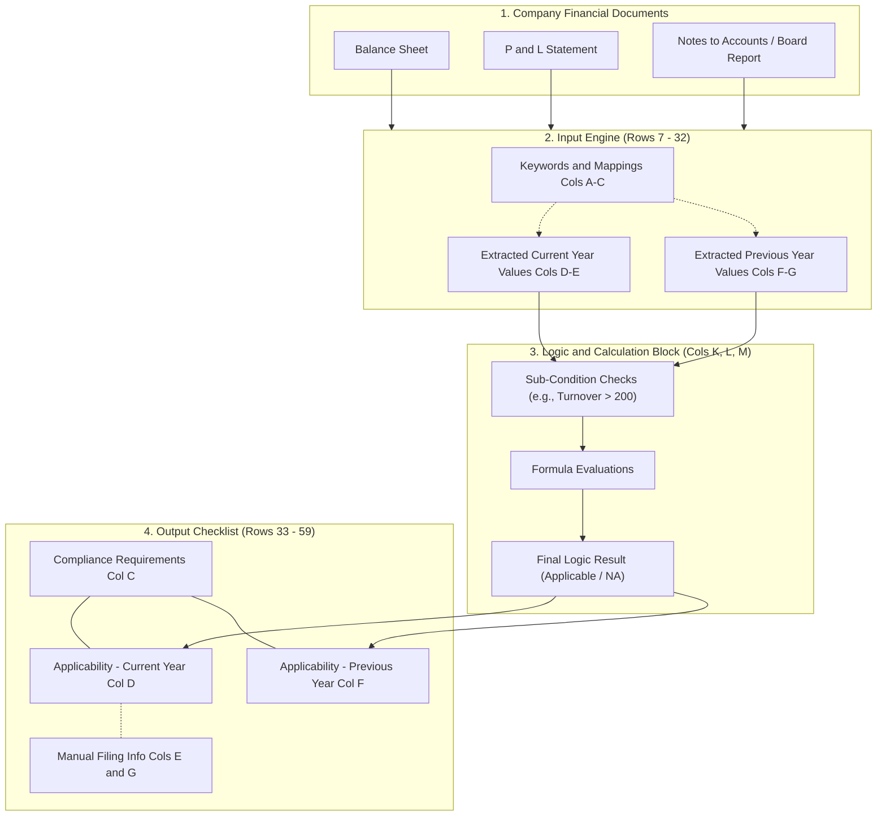

# AOC4 Compliance Excel Architecture

This diagram visualizes how data flows through the `"compliance for Private "` Excel sheet, from raw extraction to final compliance reporting.

### Key Takeaways:
- **Data Flow:** The system relies on a strictly linear flow. Raw data is extracted based on keywords (Phase 1), fed horizontally across the sheet to the logic formulas on the right (Phase 2), and then the final Boolean answers are pulled back to the left into the master checklist (Phase 3).
- **Modularity:** By keeping the logic (Phase 2) separate from the display checklist (Phase 3), the spreadsheet avoids overly complex nested `IF` statements in a single cell, making it easier to read and audit manually.
