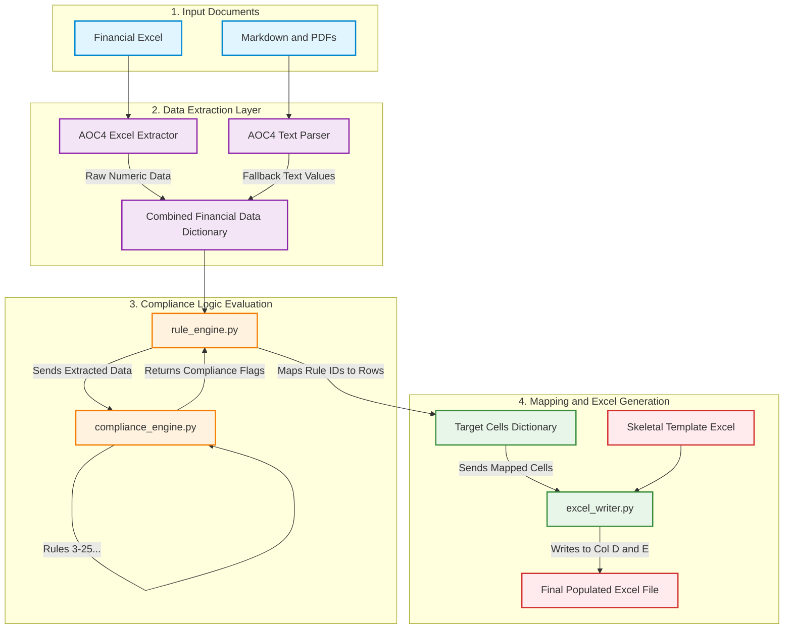

# Compliance Sheet Architecture Flow

Here is the end-to-end data flow detailing how raw financial documents are parsed and ultimately populated into the Private Compliance sheet in Excel.

### Flow Breakdown:
1. **Extraction:** The system reads the provided source documents. `excel_extractor.py` scans for standard tables, and `parser.py` uses Regex to scrape numbers from text paragraphs (if tabular data is missing).
2. **Evaluation:** `rule_engine.py` passes all extracted values (Turnover, Borrowings, etc.) to the `PrivateComplianceEngine`. The engine runs 25 math formulas and generates a status (`Applicable` / `Not Applicable`) and a detailed mathematical `Rationale` for each rule.
3. **Mapping:** The `rule_engine.py` maps the returned statuses to their exact template rows (e.g., Row 36 for CARO). Applicability maps to Column D, and the mathematical Rationale maps to Column E.
4. **Writing:** Finally, `excel_writer.py` loads the blank skeletal Excel file, injects the values into the target cells without breaking existing merged cells, and saves the populated Excel file.
