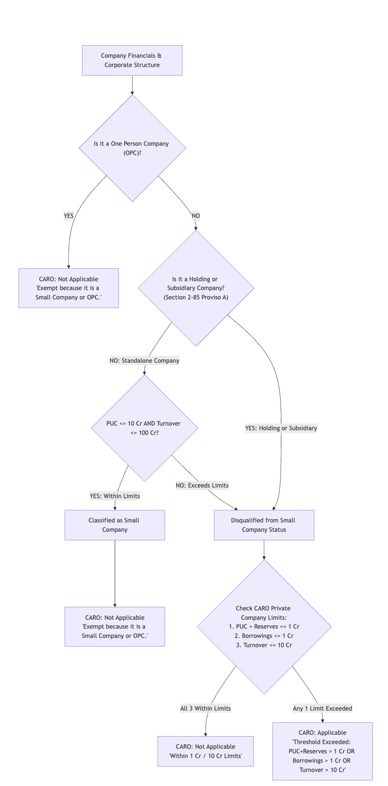

# CARO 2020 Applicability & Evaluation Guide

This document is the standalone reference guide for **Companies (Auditor's Report) Order (CARO), 2020** applicability under Section 143(11) of the *Companies Act, 2013*, as implemented in the automated AOC-4 compliance engine.

---

## 1. Statutory Provisions & Legal Hierarchy

Under **Section 143(11)** read with **Paragraph 1(2) of the Companies (Auditor's Report) Order, 2020**:

1. **Universal Exemption for Small Companies & OPCs:**CARO shall **NOT** apply to a **One Person Company (OPC)** and a **Small Company** as defined under Section 2(85) of the Act.
2. **Holding / Subsidiary Statutory Disqualification:**Under **Section 2(85) Proviso (A)**, a company that is a **holding company or a subsidiary company** cannot be classified as a Small Company, even if its capital and turnover are below the thresholds.
3. **Private Company 3-Point Exemption Limits:**A private company that is **NOT** a Small Company is exempt from CARO **only if ALL THREE** of the following conditions are satisfied:
   * **Paid-Up Capital + Reserves & Surplus** $\le$ **₹1 Crore** (as on the Balance Sheet date).
   * **Total Borrowings from Banks & Financial Institutions** $\le$ **₹1 Crore** (at any point of time during the financial year).
   * **Total Revenue / Turnover (including discontinued operations)** $\le$ **₹10 Crores** (during the financial year as per P&L).

---

## 2. CARO Decision Flowchart

---

## 3. Decision Matrix Table

|      #      | Company Type              | Holding / Subsidiary? | Small Co Criteria (PUC$\le$ 10 Cr & TO $\le$ 100 Cr) |            Small Company Status            | CARO 3-Point Limits (PUC+Res$\le$ 1 Cr, Borrowings $\le$ 1 Cr, TO $\le$ 10 Cr) |                CARO Verdict                |          System Rationale / Output Reason          |     Real-World Scenario     |                                                                                         |                                                                        |
| :---------: | :------------------------ | :-------------------: | :------------------------------------------------------------------------------------------------------------------------------------------------------------------------------------------: | :----------------------------------------: | :-------------------------------------------------: | :--------------------------: | :-------------------------------------------------------------------------------------- | :--------------------------------------------------------------------- |
| **1** | **Private Limited** |   **`No`**   |                                                                                      **`Yes`**                                                                                      |      **`Yes`** *(Small Co)*      |          *Not Checked (Exempt at Gate)*          | **`Not Applicable`** | *"Exempt because it is a Small Company or OPC."*                                      | **Phusaaram Mundhra** (PUC ₹0.17 Cr, TO ₹41.15 Cr, Standalone) |
| **2** | **Private Limited** |   **`Yes`**   |                                                                                      **`Yes`**                                                                                      | **`No`** *(Disqualified by law)* |          **`All 3 Within Limits`**          | **`Not Applicable`** | *"PUC+Reserves $\le$ 1 Cr AND Borrowings $\le$ 1 Cr AND Turnover $\le$ 10 Cr."* | Small Subsidiary with PUC+Res ₹50L, Borrowings ₹20L, TO ₹3 Cr       |
| **3** | **Private Limited** |   **`Yes`**   |                                                                                      **`Yes`**                                                                                      | **`No`** *(Disqualified by law)* | **`Any 1 Exceeded`** (e.g. Reserves > 1 Cr) |   **`Applicable`**   | *"Threshold Exceeded: PUC+Reserves (46.04 Cr) > 1 Cr OR Borrowings > 1 Cr..."*        | Subsidiary company with high reserves or bank borrowings               |
| **4** | **Private Limited** |   **`No`**   |                                                                      **`No`** *(PUC > 10 Cr or TO > 100 Cr)*                                                                      |  **`No`** *(Large Private Co)*  |            **`Any 1 Exceeded`**            |   **`Applicable`**   | *"Threshold Exceeded: Turnover (120 Cr) > 10 Cr..."*                                  | Large Standalone Private Company with Turnover > ₹100 Cr              |
| **5** | **Public / Listed** |   **`Any`**   |                                                                                      **`Any`**                                                                                      |              **`No`**              |           *Not Applicable (Public Co)*           |   **`Applicable`**   | *"Not a private company. Type is Public Limited / Listed."*                           | All Public Limited Companies (CARO is mandatory)                       |
| **6** | **OPC**             |   **`Any`**   |                                                                                      **`Any`**                                                                                      |             **`OPC`**             |          *Not Checked (Exempt at Gate)*          | **`Not Applicable`** | *"Exempt because it is a Small Company or OPC."*                                      | One Person Company (OPC)                                               |
