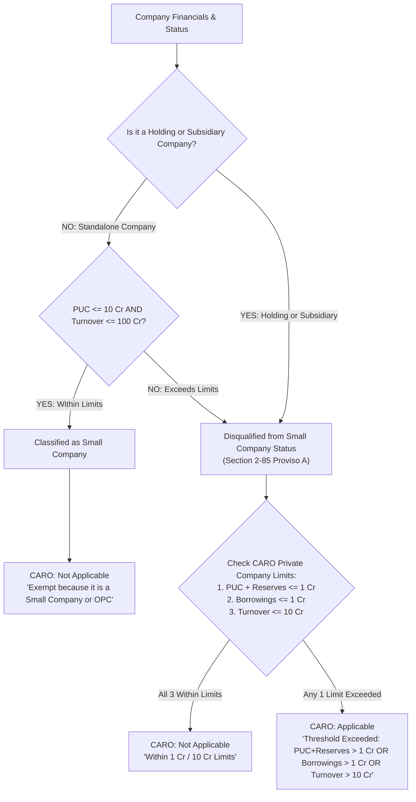

# Master Compliance & RPT Logic Engine Documentation

This document outlines the core business logic, financial thresholds, and evaluation rules required to build the automated **Compliance Calculator for Private and Public Companies**, based on the *Companies Act, 2013*. It covers general AOC-4 compliances as well as Related Party Transactions (RPT) and Loans to Directors.

## 1. Core Financial Inputs Required
To execute the rules engine, the system requires the following data points for the **Current Year (Year 0)** and **Previous Year (Year 1)**:

### Balance Sheet Items
- **Paid-up Capital (PUC)**
- **Reserves and Surplus (RS)** / Free Reserves / Securities Premium
- **Net Worth**
- **Borrowings** (Total, Secured, and from Banks/FIs)
- **Loans & Advances** given by the company
- **Investments** made by the company
- **Corporate Guarantees / Securities** given

### Profit & Loss (P&L) Items
- **Turnover / Revenue from Operations**
- **Total Revenue**
- **Net Profit Before Tax**

### Corporate & RPT Specifics
- **Corporate Structure Status** (Holding / Subsidiary / Associate / OPC / Listed)
- **Company Type** (Private Limited / Public Limited)
- **Body Corporate Shareholding** (Has any body corporate invested in its share capital?)
- **Borrowing Defaults** (Any default in repayment of borrowings?)
- **RPT Transactions:** Type of transaction (Sale, Purchase, Lease, Remuneration) and amount.
- **Loans to Directors:** Any loans to directors or interested persons/entities.

---

## 2. General Compliance Rules & Threshold Logic

### A. Small Company Status
**Rule:** Determines if the company qualifies for exemptions available to Small Companies.
* **Conditions (Must meet ALL):** 
  1. Turnover < ₹100 Crores
  2. Paid-up Capital (PUC) < ₹10 Crores
  3. MUST NOT be a Subsidiary or Holding Company.
* **Output:** `Passed (Yes, Small Company)` / `Failed (No)`

### B. CARO Applicability
**Rule:** Determines if the CARO reporting framework applies. OPCs and Small Companies are automatically exempt.

#### 1. CARO Decision Hierarchy Flow


#### 2. Decision Matrix Table
| # | Holding / Subsidiary? | Small Co Criteria (PUC $\le$ 10 Cr & TO $\le$ 100 Cr) | Small Company Status | CARO 3-Point Limits (PUC+Res $\le$ 1 Cr, Borrowings $\le$ 1 Cr, TO $\le$ 10 Cr) | CARO Verdict | System Rationale / Output Reason | Example Scenario |
| :---: | :---: | :---: | :---: | :---: | :---: | :--- | :--- |
| **1** | **`No`** | **`Yes`** | **`Yes`** *(Small Co)* | *Not Checked (Exempt at Gate)* | **`Not Applicable`** | *"Exempt because it is a Small Company or OPC."* | **Phusaaram Mundhra** (PUC 0.17 Cr, TO 41.15 Cr, Standalone) |
| **2** | **`Yes`** | **`Yes`** | **`No`** *(Disqualified by law)* | **`All 3 Within Limits`** | **`Not Applicable`** | *"PUC+Reserves $\le$ 1 Cr AND Borrowings $\le$ 1 Cr AND Turnover $\le$ 10 Cr."* | Small Subsidiary with PUC+Res ₹50L, Borrowings ₹20L, TO ₹3 Cr |
| **3** | **`Yes`** | **`Yes`** | **`No`** *(Disqualified by law)* | **`Any 1 Exceeded`** (e.g. Reserves > 1 Cr) | **`Applicable`** | *"Threshold Exceeded: PUC+Reserves (46.04 Cr) > 1 Cr OR Borrowings > 1 Cr..."* | Subsidiary with high reserves or borrowings |
| **4** | **`No`** | **`No`** *(PUC > 10 Cr or TO > 100 Cr)* | **`No`** *(Large Private Co)* | **`Any 1 Exceeded`** | **`Applicable`** | *"Threshold Exceeded: Turnover (120 Cr) > 10 Cr..."* | Large Standalone Private Company (Turnover > 100 Cr) |
| **5** | **`Any`** | **`Any`** | **`No`** | **`Public / Listed Company`** | **`Applicable`** | *"Not a private company. Type is Public Limited / Listed."* | Public Ltd Company (CARO applies mandatorily) |
| **6** | **`Any`** | **`Any`** | **`OPC`** *(One Person Co)* | *Not Checked (Exempt at Gate)* | **`Not Applicable`** | *"Exempt because it is a Small Company or OPC."* | One Person Company (OPC) |

### C. Corporate Social Responsibility (CSR)
**Rule:** Determines mandatory CSR committee formation and spending.
* **Condition (Any ONE met in preceding FY):** Net Worth ≥ ₹500 Cr OR Turnover ≥ ₹1,000 Cr OR Net Profit (Before Tax) ≥ ₹5 Cr.
* **Output:** `Applicable` / `Not Applicable`

### D. Rotation of Auditors
**Rule:** Determines if mandatory cooling-off applies.
* **Condition:** All Listed/Public Companies OR Private Companies with PUC ≥ ₹50 Crores.
* **Output:** `Applicable` / `Not Applicable`

### E. XBRL Filing
* **Condition (Any ONE met):** Listed Company (or its subsidiary), PUC ≥ ₹5 Crores, Turnover ≥ ₹100 Crores, OR required to comply with IND AS.
* **Output:** `Applicable` / `Not Applicable`

### F. Internal Financial Controls (IFC)
* **Condition:** Exempt for Private Companies if Turnover < ₹50 Crores AND Borrowings < ₹25 Crores. Otherwise, Applicable.
* **Output:** `Applicable` / `Not Applicable`

### G. Vigil Mechanism
* **Condition:** Required for Listed Companies, companies accepting public deposits, or Borrowings > ₹50 Crores.
* **Output:** `Applicable` / `Not Applicable`

### H. Internal Audit
* **Condition:** For Unlisted Private Companies: Turnover ≥ ₹200 Crores OR Borrowings ≥ ₹100 Crores.
* **Output:** `Applicable` / `Not Applicable`

### I. Secretarial Audit
* **Condition:** Listed Companies, Public Companies with PUC ≥ ₹50 Crores or Turnover ≥ ₹250 Crores, OR Any Company with Borrowings ≥ ₹100 Crores.
* **Output:** `Applicable` / `Not Applicable`

### J. MGT-8 Applicability
* **Condition:** Listed Company OR PUC ≥ ₹10 Crores OR Turnover ≥ ₹50 Crores.
* **Output:** `Applicable` / `Not Applicable`

### K. Certification of MGT-7
* **Condition:** Not applicable for Small Companies. Applicable for non-small companies.
* **Output:** `Applicable` / `Not Applicable`

### L. KMP Appointment (Key Managerial Personnel)
* **Condition:** Listed Companies OR Public Companies with PUC ≥ ₹10 Crores OR Any company required to appoint CS (PUC ≥ ₹10 Crores).
* **Output:** `Applicable` / `Not Applicable`

### M. IND AS Applicability
* **Condition:** Listed companies, or Net Worth ≥ ₹250 Crores.
* **Output:** `Applicable` / `Not Applicable`

---

## 3. RPT and Loans Logic Engine (Sections 185, 186, 188)

### N. Section 188: Related Party Transactions (AOC-2 Materiality)
**Rule:** Determines if an RPT is "Material" mandating AOC-2 filing.
* **Thresholds (Compared to Previous Year's Financials):**
  - **10% of Turnover:** Sale/purchase/supply of goods, availing/rendering services, leasing property.
  - **10% of Net Worth:** Sale/purchase/disposal of property.
  - **1% of Net Worth:** Remuneration for underwriting securities.
  - **Monthly Remuneration > 2.5 Lakhs:** Appointment to place of profit.
* **Condition:** If any single RPT transaction amount exceeds its specific threshold.
* **Output:** `AOC-2 Applicable (Material)` / `Not Applicable`

### O. Section 185: Loans to Directors
**Rule:** Governs loans given to directors or interested entities.
* **Private Company Exemptions (G.S.R 464E) (Must meet ALL):**
  1. No other body corporate has invested in the company's share capital.
  2. Borrowings from banks/FIs/Body Corporates < MIN(2 * PUC, 50 Crores).
  3. No default in repayment of borrowings subsisting.
* **Condition:** If loans are given to interested parties and exemptions are NOT met, it requires a Special Resolution.
* **Output:** `Exempt` / `Special Resolution Required` / `Non-Compliant`

### P. Section 186: Inter-corporate Loans and Investments Limit
**Rule:** Checks if loans/investments exceed permissible board-approved limits.
* **Limit Calculation:** Maximum of:
  - 60% of (Paid Up Capital + Free Reserves + Securities Premium)
  - 100% of (Free Reserves + Securities Premium)
* **Condition:** Total loans, investments, and guarantees given must be compared against this limit.
* **Output:** 
  - If within limits: `Passed (Include in Board Report)`
  - If exceeding limits: `Failed (Requires Special Resolution & MGT-8)`

---

## 4. Output Matrix Structure
The engine will return a list of evaluated flags matching this schema to be rendered on the frontend:
```json
{ 
  "id": "COMP_RPT_MATERIAL", 
  "particulars": "Is it a material transaction under Sec 188?", 
  "status": "Failed", 
  "user_value": "AOC-2 Applicable", 
  "reason": "Sale of goods exceeds 10% of Turnover", 
  "source": "Compliance Engine" 
}
```
