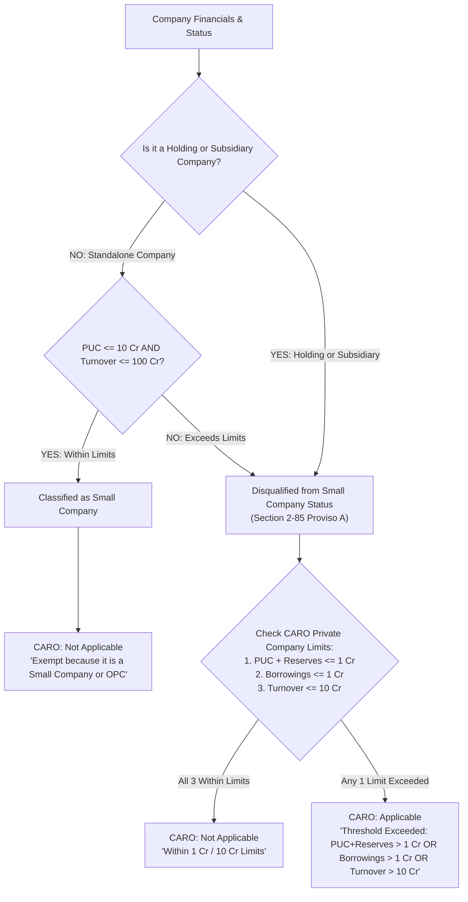

# Private Compliance Sheet - Rules & Formulas

The table below outlines the exact logic and mathematical formulas currently implemented in the `PrivateComplianceEngine` for the **Compliance sheet for private**, along with the **source documents** where the required data points are typically extracted from.

All financial thresholds are evaluated in Rupees (where 1 Crore = 1,00,00,000).

### Recent System Updates
1. **Frontend Presentation (Red Text Suppression):** Cleared the internal rationale (`reason` strings) for all `Failed` (Applicable) compliance rules. This prevents the redundant red rationale text (e.g., "Borrowings > 0" or "RPT transactions exist") from displaying on the frontend UI, keeping it clean.
2. **Numeric Extraction Upgrade (Note No Skip):** Upgraded `excel_extractor.py` to dynamically detect and skip the "Note No" column during tabular iteration. This prevents the engine from incorrectly extracting schedule reference numbers (e.g., "3") instead of actual Current Year financial values.
3. **Pipeline Execution Fix (Schedule III):** Reordered the execution pipeline in `rule_engine.py` so that Common Errors are evaluated *after* the `excel_extractor` and fallback parsers finish. This ensures rules like **Schedule III Format detection** have access to the fully extracted dataset and headers.
4. **Common Error Mapping:** Fixed the missing `SOURCE` mapping for structural headers like "Share capital Notes" so they accurately display "financials - Balance sheet - Liabilities" instead of `"nan"` on the UI.

| Row / Requirement                                                    | Implemented Logic & Formula                                                                                                                                                                                           | Primary Source for Data Points                                                                                       | Keywords                                                                                              |
| :------------------------------------------------------------------- | :-------------------------------------------------------------------------------------------------------------------------------------------------------------------------------------------------------------------- | :------------------------------------------------------------------------------------------------------------------- | :---------------------------------------------------------------------------------------------------- |
| **Is it a Small Company?**                                     | **YES** if:• `Turnover < 100 Cr`• AND `Paid-up Capital < 10 Cr`• AND `Is NOT a subsidiary or holding company`                                                                                          | **Balance Sheet** (Paid-up Capital)**P&L** (Turnover)**Board Report / Notes** (Holding/Sub status) | `revenue from operation`, `sales turnover`, `paid up capital`, `holding company`, `subsidiary company` |
| **CARO**                                                       | **Not Applicable** if:• `Is Small Company` OR `One Person Company`• OR ( `PUC + Reserves <= 1 Cr` AND `Borrowings <= 1 Cr` AND `Turnover <= 10 Cr` )**Applicable** if exemptions are not met. | **Balance Sheet** (PUC, Reserves, Borrowings)**P&L** (Turnover)                                          | `paid up capital`, `reserves and surplus`, `borrowings`, `turnover`                                   |
| **Rotation of Auditors**                                       | **Applicable** if:• `Is Listed` OR `Public Company`• OR ( `Private Company` AND `PUC >= 50 Cr` )**Not Applicable** otherwise.                                                                   | **Balance Sheet** (PUC)**Board Report / Master Data** (Listed/Public status)                             | `paid up capital`, `Listed`, `Public Company`                                                         |
| **IND AS applicability**                                       | **Applicable** if:• `Net Worth >= 250 Cr`• OR `Is Listed`• OR `Already reporting under IND AS`**Not Applicable** otherwise.                                                                      | **Balance Sheet** (Net Worth)**Audit Report / Notes** (IND AS status)                                    | `net worth`, `Listed`, `IND AS`, `Indian Accounting Standards`                                        |
| **XBRL filing**                                                | **Applicable** if:• `PUC >= 5 Cr`• OR `Turnover >= 100 Cr`• OR `Is Listed` OR `IND AS Applicable`**Not Applicable** otherwise.                                                                 | **Balance Sheet** (PUC)**P&L** (Turnover)                                                                | `paid up capital`, `turnover`, `Listed`, `IND AS`                                                     |
| **Vigil Mechanism**                                            | **Applicable** if:• `Borrowings > 50 Cr`**Not Applicable** otherwise.                                                                                                                                  | **Balance Sheet** (Borrowings)                                                                                 | `borrowings`, `long term borrowings`, `short term borrowings`                                         |
| **Internal Financial Controls**                                | **Not Applicable** if:• `Private Company` AND `Turnover < 50 Cr` AND `Borrowings < 25 Cr`**Applicable** otherwise.                                                                                 | **Balance Sheet** (Borrowings)**P&L** (Turnover)                                                         | `turnover`, `borrowings`                                                                              |
| **Internal Audit**                                             | **Applicable** if:• `Turnover >= 200 Cr`• OR `Borrowings >= 100 Cr`**Not Applicable** otherwise.                                                                                                    | **Balance Sheet** (Borrowings)**P&L** (Turnover)                                                         | `turnover`, `borrowings`                                                                              |
| **Secretarial Audit**                                          | **Applicable** if:• `Borrowings >= 100 Cr` OR `Is Listed`• OR ( `Public Company` AND (`PUC >= 50 Cr` OR `Turnover >= 250 Cr`) )**Not Applicable** otherwise.                                  | **Balance Sheet** (Borrowings, PUC)**P&L** (Turnover)                                                    | `borrowings`, `Listed`, `Public Company`, `paid up capital`, `turnover`                               |
| **KMP Appointment**                                            | **Applicable** if:• `PUC >= 10 Cr` OR `Is Listed`**Not Applicable** otherwise.                                                                                                                       | **Balance Sheet** (PUC)                                                                                        | `paid up capital`, `Listed`                                                                           |
| **Corporate Social Responsibility**                            | **Applicable** if:• `Net Worth >= 500 Cr`• OR `Turnover >= 1000 Cr`• OR `Net Profit >= 5 Cr`**Not Applicable** otherwise.                                                                        | **Balance Sheet** (Net Worth)**P&L** (Turnover, Net Profit)                                              | `net worth`, `turnover`, `profit before tax`, `CSR`                                                   |
| **MGT 8 Applicability**                                        | **Applicable** if:• `PUC >= 10 Cr`• OR `Turnover >= 50 Cr`• OR `Is Listed`**Not Applicable** otherwise.                                                                                          | **Balance Sheet** (PUC)**P&L** (Turnover)                                                                | `paid up capital`, `turnover`, `Listed`                                                               |
| **Certification of MGT 7**                                     | **Not Applicable** if:• `Is Small Company`**Applicable** otherwise.                                                                                                                                    | **Calculated** (Relies on Small Company output)                                                                | `Small Company`                                                                                       |
| **Loan and Investments** *(Loan Investment Guarantee - 186)* | **Check for Boards Approval** if:• `has_loans_investments_guarantees == True`**Not Applicable** otherwise.                                                                                             | **Balance Sheet** (Loans and Advances / Non-Current Investments)**Notes to Accounts**                    | `loans and advances`, `investments`, `corporate guarantee`                                            |
| **Loan to Director or Related entities**                       | **Check for Sec 185 Compliance** if:• `Loan to Directors > 0`**Not Applicable** otherwise.                                                                                                             | **Balance Sheet** (Loans to Directors / Related Entities)                                                      | `loans and advances to directors`, `due from directors`                                               |
| **Cost Audit**                                                 | **NA** (Always defaults to manual/NA as per template)                                                                                                                                                           | **Manual Review**                                                                                              | `Cost records`, `Cost Audit`                                                                          |
| **Charge form**                                                | **Applicable, Check if CHG form filed** if:• `Secured Loan > 0`**Not Applicable** otherwise.                                                                                      | **Balance Sheet** (Secured Loan)                                                                                 | `borrowings`, `secured loan`                                                                          |
| **AOC 1**                                                      | **Applicable, Check AOC 1 is annexed** if:• `Is a Subsidiary or Holding Company`**Not Applicable** otherwise.                                                                                          | **Balance Sheet / Notes** (Holding or Subsidiary status)                                                       | `subsidiary company`, `associate company`, `holding company`                                          |
| **AOC 2**                                                      | **Applicable, Fill in Sec 188 sheet** if:• `Sum of RPT Remunerations/Transactions > 0`**Not Applicable** otherwise.                                                                                    | **Related Party Transactions** (ED/WTD Remunerations, Sales/Purchases)                                         | `remuneration`, `sale of goods`, `purchase of goods`                                                  |
| **RPT Resolution for omnibus approval**                        | **Applicable, Fill in Sec 188 sheet** if:• `Sum of RPT Remunerations/Transactions > 0`**Not Applicable** otherwise.                                                                                    | **Related Party Transactions** (ED/WTD Remunerations, Sales/Purchases)                                         | `remuneration`, `sale of goods`, `purchase of goods`                                                  |
| **CSR Committee**                                              | **Check CSR Committee compliance** if:• `Estimated 2% of 3-Year Avg Net Profit > 50 Lakhs`**Not Applicable** otherwise.                                                                                | **P&L** (Net Profit Before Tax)w                                                                               | `profit before tax`, `CSR`, `Corporate Social Responsibility`                                         |
| **Deposit declaration**                                        | **Applicable, Is deposit declaration obtained** if:• `Loan from Directors or Relatives > 0`**Not Applicable** otherwise.                                                                               | **Related Party Transactions** (Loans from Directors/Shareholders)                                             | `loan from directors`, `loan from shareholders`                                                       |
| **DPT 3**                                                      | **Applicable, Is Form DPT 3 filed** if:• `Borrowings + Advance from Customers > 0`**Not Applicable** otherwise.                                                                                        | **Balance Sheet & Notes** (Borrowings, Advances, Security Deposits)                                            | `borrowings`, `advance from customers`, `security deposits`                                           |
| **MSME**                                                       | **Applicable, Is Form MSME filed** if:• `Dues to MSME > 0`**Not Applicable** otherwise.                                                                                                                | **Balance Sheet** (Dues to MSME)                                                                               | `dues to msme`, `customer advances`                                                                   |
| **Ben 2**                                                      | **Ben Compliance to be checked** if:• `Any shareholder name contains keywords: ltd, private limited, limited, inc`  **Not Applicable** otherwise.                                                                             | **Balance Sheet - Share Capital Notes** (Corporate Shareholder Keywords)                                         | `corporate shareholder`, `holding more than 10%`                                                      |

---

## CARO 2020: Detailed 2-Step Decision Flow & Logic

### 1. CARO Decision Flowchart

---

### 2. CARO Applicability Decision Matrix Table

| # | Holding / Subsidiary? | Small Co Criteria (PUC $\le$ 10 Cr & TO $\le$ 100 Cr) | Small Company Status | CARO 3-Point Limits (PUC+Res $\le$ 1 Cr, Borrowings $\le$ 1 Cr, TO $\le$ 10 Cr) | CARO Verdict | System Rationale / Output Reason | Example Scenario |
| :---: | :---: | :---: | :---: | :---: | :---: | :--- | :--- |
| **1** | **`No`** | **`Yes`** | **`Yes`** *(Small Co)* | *Not Checked (Exempt at Gate)* | **`Not Applicable`** | *"Exempt because it is a Small Company or OPC."* | **Phusaaram Mundhra** (PUC 0.17 Cr, TO 41.15 Cr, Standalone) |
| **2** | **`Yes`** | **`Yes`** | **`No`** *(Disqualified by law)* | **`All 3 Within Limits`** | **`Not Applicable`** | *"PUC+Reserves $\le$ 1 Cr AND Borrowings $\le$ 1 Cr AND Turnover $\le$ 10 Cr."* | Small Subsidiary with PUC+Res ₹50L, Borrowings ₹20L, TO ₹3 Cr |
| **3** | **`Yes`** | **`Yes`** | **`No`** *(Disqualified by law)* | **`Any 1 Exceeded`** (e.g. Reserves > 1 Cr) | **`Applicable`** | *"Threshold Exceeded: PUC+Reserves (46.04 Cr) > 1 Cr OR Borrowings > 1 Cr..."* | Subsidiary with high reserves or borrowings |
| **4** | **`No`** | **`No`** *(PUC > 10 Cr or TO > 100 Cr)* | **`No`** *(Large Private Co)* | **`Any 1 Exceeded`** | **`Applicable`** | *"Threshold Exceeded: Turnover (120 Cr) > 10 Cr..."* | Large Standalone Private Company (Turnover > 100 Cr) |
| **5** | **`Any`** | **`Any`** | **`No`** | **`Public / Listed Company`** | **`Applicable`** | *"Not a private company. Type is Public Limited / Listed."* | Public Ltd Company (CARO applies mandatorily) |
| **6** | **`Any`** | **`Any`** | **`OPC`** *(One Person Co)* | *Not Checked (Exempt at Gate)* | **`Not Applicable`** | *"Exempt because it is a Small Company or OPC."* | One Person Company (OPC) |

---

### 3. Summary of Rule Execution

1. **Step 1: Check OPC / Small Company Exemption (Highest Priority)**
   * If company is **One Person Company (OPC)** $\rightarrow$ **`Not Applicable`**.
   * If company is **Standalone** (`Holding/Sub = No`) AND **PUC $\le$ ₹10 Cr** AND **Turnover $\le$ ₹100 Cr** $\rightarrow$ **`Not Applicable`** *(Small Company Exemption)*.

2. **Step 2: Check Holding / Subsidiary Disqualification**
   * If `Holding/Sub = Yes`, it is **disqualified from being a Small Company** by Section 2(85) Proviso (A). It **must** proceed to Step 3.

3. **Step 3: Check CARO 3-Point Limits (Only for Non-Small Private Companies)**
   * If **ALL 3** conditions are met:
     1. $\text{Paid-Up Capital} + \text{Reserves} \le ₹1\text{ Crore}$
     2. $\text{Total Borrowings} \le ₹1\text{ Crore}$
     3. $\text{Turnover} \le ₹10\text{ Crore}$  
     $\rightarrow$ **`Not Applicable`**.
   * If **ANY ONE** limit is breached $\rightarrow$ **`Applicable`**.
