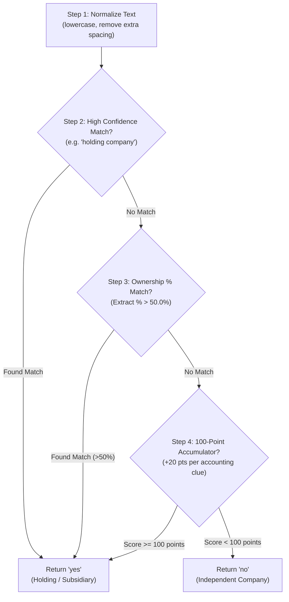

# Code Logic Flow: Holding & Subsidiary Detection

This diagram illustrates the exact 5-step execution flow happening inside the Python `_evaluate_holding_status` function:

```mermaid
graph TD
    S1["Step 1: Normalize Text\n(lowercase, remove extra spacing)"]
    S2{"Step 2: High Confidence Match?\n(e.g. 'holding company')"}
    S3{"Step 3: Ownership % Match?\n(Extract % > 50.0%)"}
    S4{"Step 4: 100-Point Accumulator?\n(+20 pts per accounting clue)"}
    
    Yes["Return 'yes'\n(Holding / Subsidiary)"]
    No["Return 'no'\n(Independent Company)"]

    %% Flow path
    S1 --> S2
    
    S2 -- "Found Match" --> Yes
    S2 -- "No Match" --> S3
    
    S3 -- "Found Match (>50%)" --> Yes
    S3 -- "No Match" --> S4
    
    S4 -- "Score >= 100 points" --> Yes
    S4 -- "Score < 100 points" --> No
```
