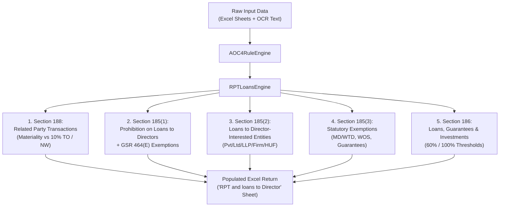
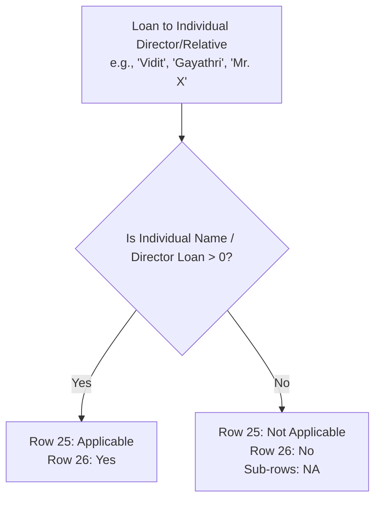
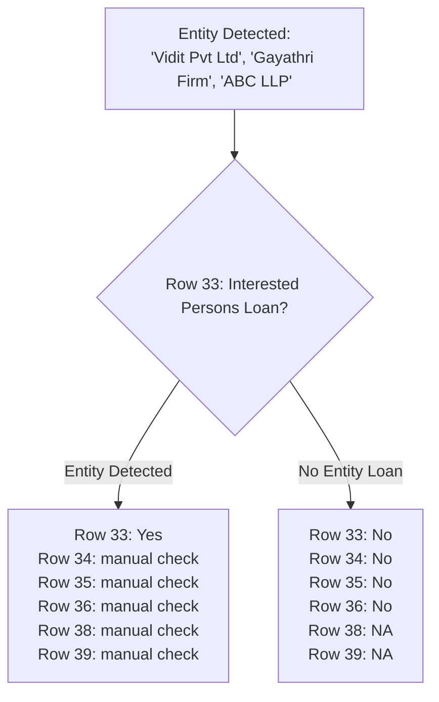

# Complete Rulebook & Logic Guide: RPT and Loans Compliance Engine

This guide documents every single field, logic rule, extraction source, formula, and decision outcome implemented in the **`RPT and loans to Director`** compliance module of the AOC-4 engine (`rpt_loans_engine.py`).

---

## Architecture & Flow Overview



---

## 1. SECTION 188: Related Party Transactions (RPT)

### 1.1 Benchmark Thresholds (Rows 6–7)
The system calculates materiality thresholds based on **Previous Year figures**:
* **Turnover Benchmark (Row 6 / Cell `C6`)**: 10% of Previous Year Turnover
* **Net Worth Benchmark (Row 7 / Cell `C7`)**: 10% of Previous Year Net Worth

### 1.2 Transaction Evaluation Table (Rows 11–20)
For each Related Party Transaction, the **Extracted Amount** is populated in **Excel Column F**, and the **Materiality Verdict** (`"Yes"` or `"No"`) is written in **Excel Column G**:

| Row | Transaction Particulars | Statutory Threshold Limit | Data Source & Extraction Keywords (into Col F) | Output in Excel Col G (Materiality Verdict) |
| :---: | :--- | :--- | :--- | :--- |
| **11** | **Sale of Goods** | **10% of Previous Year Turnover** | `rpt_sale_goods` (`sale of goods`, `sale of materials`, `supply of goods`, `sales to related parties`) | **`"Yes"`** (if 10% Turnover or more)<br>**`"No"`** (if less than 10% Turnover or Nil) |
| **12** | **Purchase of Goods / Materials** | **10% of Previous Year Turnover** | `rpt_purchase_goods` (`purchase of goods`, `purchase of materials`, `purchase or supply of goods`) | **`"Yes"`** (if 10% Turnover or more)<br>**`"No"`** (if less than 10% Turnover or Nil) |
| **13** | **Sale of Property** | **10% of Previous Year Net Worth** | `rpt_sale_property` (`sale of property`, `sale of fixed assets`, `sale of immovable property`, `sale of land`) | **`"Yes"`** (if 10% Net Worth or more)<br>**`"No"`** (if less than 10% Net Worth or Nil) |
| **14** | **Purchase of Property** | **10% of Previous Year Net Worth** | `rpt_purchase_property` (`purchase of property`, `purchase of fixed assets`, `purchase of land`) | **`"Yes"`** (if 10% Net Worth or more)<br>**`"No"`** (if less than 10% Net Worth or Nil) |
| **15** | **Dispose of Property** | **10% of Previous Year Net Worth** | `rpt_dispose_property` (`disposal of property`, `dispose of property`, `transfer of property`) | **`"Yes"`** (if 10% Net Worth or more)<br>**`"No"`** (if less than 10% Net Worth or Nil) |
| **16** | **Availing of Services** | **10% of Previous Year Turnover** | `rpt_availing_service` (`availing of services`, `availing of service`, `services availed`, `service charges paid`) | **`"Yes"`** (if 10% Turnover or more)<br>**`"No"`** (if less than 10% Turnover or Nil) |
| **17** | **Rendering of Services** | **10% of Previous Year Turnover** | `rpt_rendering_service` (`rendering of services`, `rendering of service`, `services rendered`, `service charges received`) | **`"Yes"`** (if 10% Turnover or more)<br>**`"No"`** (if less than 10% Turnover or Nil) |
| **18** | **Lease / Rent** | **10% of Previous Year Turnover** | `rpt_lease` (`lease`, `rent`, `rental`, `lease rent`, `lease payments`, `premises rent`) | **`"Yes"`** (if 10% Turnover or more)<br>**`"No"`** (if less than 10% Turnover or Nil) |
| **19** | **Appointment to Office/Place of Profit** | **Exceeding ₹2.5 Lakhs per month** | `rpt_monthly_remun` (`remuneration paid to directors`, `managerial remuneration`, `monthly remuneration`, `salary`) | **`"Yes"`** (if over ₹2.5 Lakhs/month)<br>**`"No"`** (if up to ₹2.5 Lakhs/month or Nil) |
| **20** | **Underwriting Remuneration** | **1% of Previous Year Net Worth** | `rpt_remuneration_underwriting` (`remuneration for underwriting`, `underwriting commission`, `underwriting remuneration`) | **`"Yes"`** (if 1% Net Worth or more)<br>**`"No"`** (if less than 1% Net Worth or Nil) |

> [!NOTE]
> If any transaction in Rows 11–20 is **`"Yes"`** (Material), Form **AOC-2 disclosure** is required.

---

## 2. SECTION 185(1): Prohibition on Loans to Directors & GSR 464(E)

### 2.1 Applicability & Individual Loan Checks (Rows 25–27)



| Row | Particulars | Logic & Source | Output (`user_value`) |
| :--- | :--- | :--- | :--- |
| **25** | **Loans to directors or interested persons** | Evaluates if `has_loans_to_directors` is True or `loan_to_directors_assets > 0`. | **`"Applicable"`** / **`"Not Applicable"`** |
| **26** | **Has the company given any loan to Directors/holding co/partner/relative** | Checks if loan given to an **individual person** (`"Vidit"`, `"Gayathri"`, `"Mr. X"`, etc. without entity suffix), or OCR text has `loan to director`. | **`"Yes"`** (if individual loan detected)<br>**`"No"`** (if no loan) |
| **27** | **Has the company given any loan to any firm in which director is partner** | Checks for loans given directly to partnership firms where director is partner. | **`"No"`** / **`"Yes"`** |

---

### 2.2 GSR 464(E) Notification: Private Company Exemption Conditions (Rows 29–32)

Private companies are exempt from Section 185 loan prohibitions **only if all 3 conditions are met**:

| Row | Particulars | Condition Checked | Output (`user_value`) | Flag Status |
| :--- | :--- | :--- | :--- | :--- |
| **29** | **No other body corporate has invested in its share capital** | Detects corporate shareholders from Master Data / Input Sheet (`has_corporate_shareholders`). | **`"yes body corporate"`** (if corporate shareholder exists)<br>**`"Yes"`** (if pure individual shareholding) | `Failed` / `Passed` |
| **30** | **Its borrowings from banks/FIs is less than 2x PUC or 50 Cr, whichever is lower** | Compares `borrowings` against lower of (2 times Paid-up Capital or ₹50 Crore). | **`"yes loan is exceeding"`** (if limit breached)<br>**`"Yes"`** (if within limit) | `Failed` / `Passed` |
| **31** | **No default in repayment of such borrowings subsisting at the time of transaction** | Requires verification of repayment track record with lending banks. | **`"manual check"`** | `Manual` |
| **32** | **Even if one of the above conditions are YES, Private companies cannot provide loan to its directors...** | Synthesizes Rows 29 and 30 to determine overall statutory compliance: | **`"since both condition is yes - Non- compliance"`** (if both violated)<br>**`"Non- compliance"`** (if 1 violated)<br>**`"Not applicable"`** (if conditions satisfied or no loans) | `Failed` / `Passed` |

---

## 3. SECTION 185(2): Loans to Director-Interested Entities (Rows 33–39)

### 3.1 Entity Keyword Detection Engine
When a loan is given to an **entity** (rather than an individual), the system scans recipient names against keywords:
* **Private Limited:** `pvt ltd, private limited, pvt`
* **Public / Corp:** `ltd, plc, corp, inc, co.`
* **Partnerships / LLPs:** `llp, llc, firm, enterprise, ventures`
* **HUF:** `huf`

### 3.2 Evaluation Rules (Rows 33–39)



| Row | Particulars | Trigger Condition | Output if Entity Loan Given | Output if No Entity Loan |
| :--- | :--- | :--- | :--- | :--- |
| **33** | **Has company given loan/guarantee to interested persons** | Matches entity keywords in input sheet or OCR text. | **`"Yes"`** | **`"No"`** |
| **34** | **Any private company of which director is director/member** | Sub-check for Pvt Ltd entities. | **`"manual check"`** | **`"No"`** |
| **35** | **Any body corporate where director holds 25% or more voting power** | Sub-check for voting control. | **`"manual check"`** | **`"No"`** |
| **36** | **Any body corporate whose Board is accustomed to act on director's directions** | Sub-check for management control. | **`"manual check"`** | **`"No"`** |
| **38** | **Special resolution is passed by company in general meeting** | Compliance requirement under Sec 185(2). | **`"manual check"`** | **`"NA"`** |
| **39** | **Loans utilised by borrowing co for principal business activities** | Compliance requirement under Sec 185(2). | **`"manual check"`** | **`"NA"`** |

---

## 4. SECTION 185(3): Statutory Exemptions (Rows 41–47)

| Row | Exemption Category | Logic & Detection | Output (`user_value`) |
| :--- | :--- | :--- | :--- |
| **42** | **Loans to Managing Director (MD) or Whole-Time Director (WTD)** | **1. Loan Check:** Checks Balance Sheet Assets / RPT / Input Sheet for loan to director.<br>**2. Designation Check:** If loan exists, checks DIR-12 designations (`MD`, `WTD`, `Executive Director`) or executive remuneration. | **`"Yes"`** (if loan given & recipient is MD/WTD)<br>**`"No"`** (if loan given but director is non-executive)<br>**`"NA"`** (if no loan given to any director) |
| **43** | **Conditions of service extended to all employees** | Standard employee loan policy exemption. | **`"Manual check"`** |
| **44** | **Scheme approved by members by special resolution** | Shareholder-approved employee loan scheme. | **`"Manual check"`** |
| **45** | **Ordinary course of business (NBFC / Banking at G-Sec yield)** | Lending business charging interest at or above Government Security yield. | **`"Manual check"`** |
| **46** | **Loan/Guarantee by Holding Co to Wholly Owned Subsidiary (WOS)** | Detects entity loans (`"Vidit Pvt"`, `"Gayathri LLP"`) or `is_subsidiary_or_holding == 'holding'`. Scans RPT notes for Wholly Owned Subsidiary (WOS) status as a fallback. | **`"Yes"`** (if confirmed WOS in RPT/FS)<br>**`"check if the entity is WOS"`** (with RPT note as fallback)<br>**`"NA"`** (if no loans/guarantees) |
| **47** | **Guarantee/Security by Holding Co for loan to Subsidiary** | Scans for `"guarantee"`, `"security provided"` while **explicitly ignoring `"security deposit"`**. | **`"check if guarantee is for subsidiary"`**<br>(or `"NA"` if no loans) |

---

## 5. SECTION 186: Loans, Guarantees & Investments (Rows 48–54)

### 5.1 Activity Triggers (Rows 48–49)
* **Row 48 (`COMP_SEC_186_LOANS`)**: *"Has the Company given loan, guarantee to any person or body corporate"*
  * Checks: `loan_given_by_company > 0`, `corporate_guarantees > 0`, entity loan patterns (`Pvt`, `Ltd`, `Firm`, `HUF`, `LLP`, `Inc`), or guarantee text (ignoring security deposits).
  * **Output**: **`"Yes"`** / **`"No"`**.
* **Row 49 (`COMP_SEC_186_SEC`)**: *"Has the Company acquired securities of any other body corporate"*
  * Checks: `investments_made > 0`.
  * **Output**: **`"Yes"`** / **`"No"`**.

---

### 5.2 Threshold Limits Calculation (Rows 51–52)
When Section 186 is triggered, statutory limits are calculated in absolute Rupees:
* **Limit 1 (Row 51)**: 60% of (Paid-up Capital + Free Reserves + Securities Premium)
* **Limit 2 (Row 52)**: 100% of (Free Reserves + Securities Premium)
* **Statutory Max Limit**: Higher of Limit 1 and Limit 2

---

### 5.3 Limit Adherence & Reporting (Rows 53–54)

* **Total Loans & Investments**: Loans Given + Investments Made + Corporate Guarantees

| Row | Particulars | Within Limits (Total is within Max Limit) | Exceeding Limits (Total exceeds Max Limit) | No Loans/Investments |
| :--- | :--- | :---: | :---: | :---: |
| **53** | **If within limits, include in Board report** | **`"Yes"`** | **`"No"`** | **`"NA"`** |
| **54** | **If exceeding limit, to mention in MGT 8 & prior approval/ratification in next AGM/EGM** | **`"No"`** | **`"check SR"`** *(triggers MGT-8 & SR check)* | **`"NA"`** |

---

## 6. Summary Cheat Sheet: Key Verdicts

```text
┌───────────────────────────────────────────────┬──────────────────────────────────────────┐
│ Compliance Condition                          │ Engine User Output                       │
├───────────────────────────────────────────────┼──────────────────────────────────────────┤
│ Individual Director Loan (Vidit / Gayathri)  │ "Yes"                                    │
│ Entity Loan (Vidit Pvt / Gayathri Firm)       │ "Yes" (triggers sub-row manual checks)   │
│ Body Corporate Shareholder in Capital         │ "yes body corporate"                     │
│ Borrowings Exceed 2x PUC or 50 Cr             │ "yes loan is exceeding"                  │
│ GSR 464(E) Conditions Violated                │ "Non- compliance" / "since both..."      │
│ MD / WTD Loan Exemption                       │ "Yes" (if MD/WTD) / "No" (if Non-MD)     │
│ Holding to WOS Loan                           │ "check if the entity is WOS" / "Yes"     │
│ Guarantee Provided (Ignoring Security Deposit)│ "check if guarantee is for subsidiary"   │
│ Section 186 Limit Exceeded                    │ "check SR"                               │
└───────────────────────────────────────────────┴──────────────────────────────────────────┘
```
