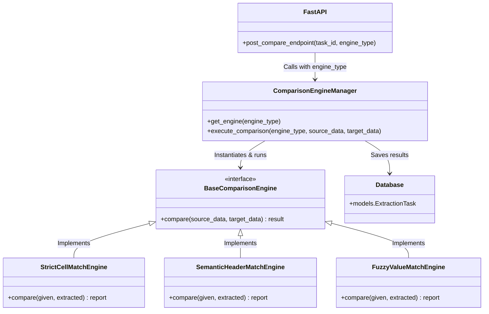

# Comparison Module Implementation Plan

This plan details the creation of a new, scalable comparison module within the FLA AI platform's backend (`automation_engine`). The primary goal is to compare a user-provided ("given") Excel file with the system-generated ("extracted") Excel file.

## Goal Description
Implement an extensible comparison engine that currently supports Excel-to-Excel comparison but is designed to scale, allowing new comparison modules (e.g., PDF-to-Excel, JSON-to-Excel, or semantic comparisons) to be easily plugged in later.

> [!IMPORTANT]
> **User Review Required**: Please review the **Proposed Architecture** and **Open Questions** to ensure the design aligns with your future scalability goals before we begin execution.

## Open Questions
1. **Comparison Strategy**: For the Excel comparison, should the comparison be strict cell-by-cell (e.g., Sheet1!A1 vs Sheet1!A1) or row/column header-based (e.g., looking for a specific entity name regardless of the exact row number)?
2. **Result Storage**: Should the comparison results be stored persistently in the SQLite database, or is it sufficient to return the comparison report directly via the API response for the frontend to display?
3. **Future Modules**: What other specific comparison modules do you envision bringing in later? Knowing this can help us refine the base interfaces.

## Proposed Architecture

We will implement a Strategy Pattern for the comparison engines. This allows us to define a common interface that any future comparison engine can implement based on different business **use cases** (rather than just file types).

### Visual Architecture

### 1. Engine Architecture (Backend)

We will create a new directory `automation_engine/engine/comparison/`.

#### [NEW] `engine/comparison/base.py`
- Define an abstract base class `BaseComparisonEngine`.
- Enforces a standard `compare(source_data, target_data)` method and returns a standardized diff/report format.

#### [NEW] `engine/comparison/engines/strict_match.py`
- Implement `StrictCellMatchEngine` as the first implementation.
- Logic to compare Excel files strictly cell-by-cell (e.g., ensuring A1 matches A1 exactly).

#### [NEW] `engine/comparison/manager.py`
- A factory/manager class `ComparisonEngineManager` that dynamically loads the requested comparison engine based on the *use case*.

### 2. API Updates

#### [MODIFY] `api/models.py`
- Update the database schema to store comparison results. We can add a `comparison_results` JSON column to the `ExtractionTask` model, or create a separate `ComparisonReport` model linked to the task.

#### [MODIFY] `api/main.py`
- Add a new endpoint: `POST /api/compare/{task_id}`.
- This endpoint will accept a `given_excel` file upload.
- It will retrieve the `output_excel` associated with the `task_id`.
- It will invoke the `ComparisonManager` with the `ExcelComparisonModule`.
- It will save and return the comparison results to the frontend.

### 3. Frontend Updates (`fla_frontend`)

We will update the existing React UI, primarily focusing on `src/pages/TaskView.jsx`.

#### [MODIFY] `src/pages/TaskView.jsx`
- Add a new "Comparison Module" section visible when a task's status is `completed`.
- Include a drag-and-drop file upload zone allowing the user to select the "Given Excel" file.
- Upon upload, make a `POST` request to `/api/compare/{taskId}`.
- Render the response data in a clean data table showing columns for:
  - Cell Reference (e.g., `B3`)
  - Extracted Value (from the system)
  - Given Value (from the uploaded Excel)
  - Status (e.g., `Match`, `Mismatch`, `Missing`) with appropriate colored badges.

#### UI Mockup

Here is a visual mockup of what the Comparison Module UI will look like within the `TaskView`:

### 4. Scaling to Multiple Modules (Visuals & Flow)

To make the Comparison Module truly scalable, both the backend and frontend will be designed to handle multiple comparison types seamlessly. 

#### UI Workflow for Multiple Modules
1. **Module Selection**: The UI will introduce a dropdown menu to select the "Comparison Type" (e.g., `Excel to Excel`, `PDF to Excel`, `JSON to Excel`).
2. **Dynamic Inputs**: Based on the selected module, the UI will dynamically render the required file upload zones (e.g., asking for a PDF instead of an Excel file).
3. **API Routing**: The frontend will pass the selected `module_type` in the request body to `/api/compare/{taskId}`.
4. **Backend Manager**: The `ComparisonManager` will read the `module_type` and route the request to the corresponding concrete class (e.g., `PDFComparisonModule` or `JSONComparisonModule`).

#### UI Mockup for Multiple Modules

Here is a visual mockup illustrating how the UI will scale to support selecting and interacting with different comparison modules:

## Verification Plan

### Automated Tests
- Create `test_comparison.py` in the backend tests.
- Provide two dummy Excel files with known differences.
- Assert that the `ExcelComparisonModule` correctly identifies the exact mismatches, missing values, and matches.
- Assert that the `ComparisonManager` correctly routes to the appropriate module.

### Manual Verification
- Start the FastAPI backend and frontend.
- Run an extraction task to generate an `extracted_excel`.
- Upload a modified version of that Excel file through a Swagger UI or API client as the `given_excel`.
- Verify the API response correctly lists the structural or value differences.
