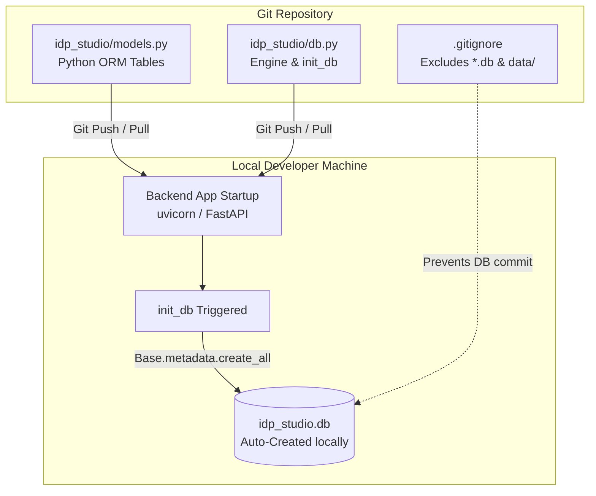

# 🗄️ IDP Studio — Professional Database Isolation & Code-First Schema Implementation Plan

> **Project:** Foreign Liabilities & Assets (FLA) / IDP Studio Automation Engine  
> **Module:** `automation_engine/modules/idp_studio`  
> **Objective:** Establish an isolated, code-first SQLite database architecture (`idp_studio.db`) so developers can define, modify, and share database tables via Git without committing binary `.db` files.

---

## 1. Executive Summary & Architectural Workflow

In professional software development, binary database files (`*.db`) are never committed to version control (`.gitignore`). Pushing binary database files causes Git merge conflicts and risks overwriting local development data.

Instead, IDP Studio implements a **Code-First Schema Architecture**. Git tracks only Python ORM model definitions (`models.py`) and initialization logic (`db.py`). Whenever any developer starts the backend application, their local SQLite database file (`idp_studio.db`) is automatically generated or verified against the latest code schema.

---

## 2. Step-by-Step Technical Implementation Plan

### Phase 1: Database Engine Isolation (`automation_engine/modules/idp_studio/db.py`)
* **Goal**: Isolate all IDP Studio tables into a dedicated database file (`idp_studio.db`) inside the `/data` directory so it never collides with the main `fla_tasks.db`.
* **Implementation Description**:
  * Define the absolute path pointing to `/data/idp_studio.db`.
  * Create an asynchronous-safe SQLite engine (`check_same_thread=False`).
  * Expose an `init_db()` function that imports all ORM models from `models.py` and calls `Base.metadata.create_all(bind=engine)`.

---

### Phase 2: Code-First Schema Definition (`automation_engine/modules/idp_studio/models.py`)
* **Goal**: Enable the IDP developer to create and modify database tables by writing standard Python classes instead of SQL scripts.
* **Implementation Description**:
  * All database tables inherit from the declarative `Base` defined in `db.py`.
  * Each class defines `__tablename__`, primary keys, indexed columns, and relationships.
  * When a developer wants to "push a new table," they add a new class to `models.py` and commit the file to Git.

---

### Phase 3: Automated Startup Hook (`automation_engine/api/main.py`)
* **Goal**: Eliminate manual database setup so new developers get an operational database zero-touch upon running the server.
* **Implementation Description**:
  * In the FastAPI startup event (or lifespan handler) of the main application, invoke `idp_studio.db.init_db()`.
  * When `uvicorn` starts, the system checks if `idp_studio.db` exists. If missing, it creates the file and generates all tables. If it exists, it verifies table integrity.

---

### Phase 4: Seed Data & Future Migrations Strategy
* **Default Seed Data**: For initial lookup rules or templates that must exist by default, create a standalone `seed_idp.py` script. The developer can push this script to Git so any team member can run it to populate standard data.
* **Schema Evolution (Migrations)**: When a developer needs to alter existing table columns in production, the team will transition to **Alembic migrations** (`alembic revision --autogenerate`), tracking migration scripts in Git rather than recreating tables from scratch.

---

## 3. Developer Handover & Workflow Guide

Share these exact operational instructions with the developer working on IDP Studio:

| Action | Professional Workflow (What to Do) | Anti-Pattern (What NOT to Do) |
| :--- | :--- | :--- |
| **Creating a New Table** | Define a new SQLAlchemy model class inside `idp_studio/models.py`. | Do not open a SQLite DB tool, manually create a table, and attempt to save the `.db` file. |
| **Sharing Schema Changes** | Commit and push `idp_studio/models.py` (and any new seed scripts) to Git. | Do not use `git add -f` to force push a `.db` binary file to the repository. |
| **Testing Locally** | Start the backend server (`uvicorn`). The `init_db()` hook will automatically create your tables in your local `idp_studio.db`. | Do not copy-paste `.db` files between team members over Slack or email. |
| **Adding Default Data** | Write an idempotent Python script (`seed_idp.py`) that inserts initial rows using SQLAlchemy sessions. | Do not insert rows manually into your local DB and expect others to see them. |

---

## 4. Verification & Acceptance Checklist

Before signing off on the IDP Studio Database Isolation setup, verify the following:

1. **Git Exclusivity Check:**
   * Run `git status -u`. Confirm that no `*.db`, `*.sqlite`, or files inside the `/data` directory are staged or tracked by Git.
2. **Zero-Touch Generation Check:**
   * Delete or rename your local `idp_studio.db` file.
   * Start the backend app (`python -m uvicorn main:app`).
   * Verify that a fresh `idp_studio.db` is automatically created on startup with all tables from `models.py`.
3. **Table Isolation Check:**
   * Inspect `idp_studio.db` using a SQLite client. Confirm it contains only IDP Studio tables (`idp_templates`, `idp_schema_alias_rules`, etc.) and zero FLA task tables.
