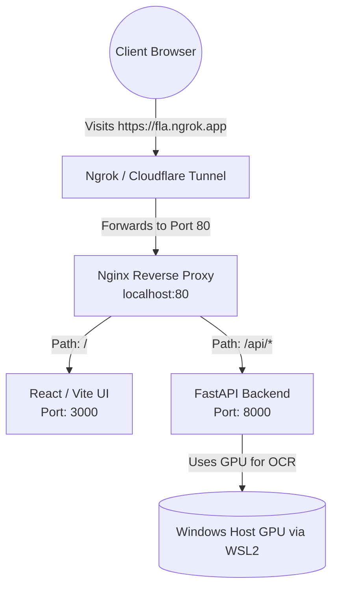

# Deployment Architecture & Implementation Guide

This guide details the steps and architecture required to deploy the FLA Automation Engine on a local Windows machine equipped with a GPU, and expose it securely to external clients over the internet.

## 1. System Architecture

To avoid Cross-Origin Resource Sharing (CORS) issues and simplify external access, the platform uses an **Nginx Reverse Proxy**. This allows both the Frontend UI and Backend API to be accessed through a single, unified URL.



## 2. Infrastructure Prerequisites

Since the host machine is a Windows system, the following must be installed to allow Docker containers to utilize the physical GPU:

1. **NVIDIA Windows Drivers**: Ensure the standard Game Ready or Studio drivers are installed.
2. **WSL 2**: Windows Subsystem for Linux must be enabled.
3. **Docker Desktop**: Install Docker Desktop and ensure the **"Use the WSL 2 based engine"** option is checked in settings.

> [!IMPORTANT]
> Docker Desktop handles GPU passthrough automatically on Windows via WSL 2. You do not need to manually install the `nvidia-container-toolkit` as you would on a pure Linux server.

## 3. Containerization Strategy

You will need a `docker-compose.yml` file at the root of your project to orchestrate the three services.

### `docker-compose.yml` Structure

```yaml
version: '3.8'

services:
  # 1. The React Frontend
  frontend:
    build: ./fla_frontend
    restart: always

  # 2. The Python FastAPI Backend
  backend:
    build: ./automation_engine
    restart: always
    deploy:
      resources:
        reservations:
          devices:
            - driver: nvidia
              count: 1
              capabilities: [gpu]
    volumes:
      - ./data:/app/data

  # 3. The Nginx Reverse Proxy
  nginx:
    image: nginx:latest
    ports:
      - "80:80"
    volumes:
      - ./nginx.conf:/etc/nginx/nginx.conf
    depends_on:
      - frontend
      - backend
```

### `nginx.conf` Configuration
Create an `nginx.conf` file in the same directory. This is the "Receptionist" that routes traffic based on the URL path:

```nginx
events {}

http {
    server {
        listen 80;

        # Route API requests to the Backend
        location /api/ {
            proxy_pass http://backend:8000/;
            proxy_set_header Host $host;
            proxy_set_header X-Real-IP $remote_addr;
        }

        # Route all other requests to the Frontend
        location / {
            proxy_pass http://frontend:3000/;
            proxy_set_header Host $host;
            proxy_set_header X-Real-IP $remote_addr;
        }
    }
}
```

> [!TIP]
> In your frontend source code, change your API calls from `http://localhost:8000/...` to `/api/...`. The browser will automatically resolve this to the current domain, and Nginx will handle the routing seamlessly.

## 4. Exposing to the Client (External Access)

Once you run `docker-compose up -d`, the application is available locally at `http://localhost`. To grant access to a client in another city, use a tunneling service.

### Option A: Ngrok (Best for Quick Demos)
1. Download [Ngrok](https://ngrok.com/download) for Windows.
2. Open Command Prompt and run:
   ```cmd
   ngrok http 80
   ```
3. Ngrok will output a secure URL (e.g., `https://random-id.ngrok-free.app`). Send this link to the client.

### Option B: Cloudflare Tunnels (Best for Production)
For a permanent, branded URL (e.g., `fla.yourcompany.com`) without opening Windows firewall ports:
1. Create a free Cloudflare account and navigate to Zero Trust -> Tunnels.
2. Create a new tunnel and select "Windows" for the environment.
3. Run the provided installation command on your Windows machine.
4. Route your domain (e.g., `fla.yourcompany.com`) to `http://localhost:80` inside the Cloudflare dashboard.

> [!CAUTION]
> If you are processing highly sensitive financial documents via the public internet, ensure your FastAPI backend has proper authentication (e.g., username/password or JWT tokens) before sharing the link, as anyone with the URL will be able to access the platform.
