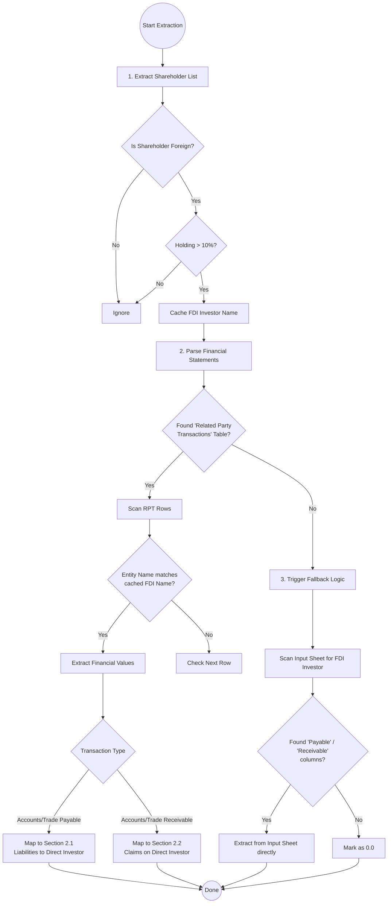

# Section 3: Liabilities and Claims Extraction Flow

The diagram below illustrates the exact step-by-step logic the Rule Engine will follow to extract Section 3 data.

```mermaid
flowchart TD
    Start((Start Extraction)) --> ExtractSH[1. Extract Shareholder List]
  
    ExtractSH --> IsForeign{Is Shareholder Foreign?}
    IsForeign -- Yes --> CheckFDI{Holding > 10%?}
    IsForeign -- No --> Skip[Ignore]
  
    CheckFDI -- Yes --> CacheName[Cache FDI Investor Name]
    CheckFDI -- No --> Skip
  
    CacheName --> ParseFin[2. Parse Financial Statements]
    ParseFin --> FindRPT{Found 'Related Party\nTransactions' Table?}
  
    FindRPT -- Yes --> ScanRPT[Scan RPT Rows]
    FindRPT -- No --> Fallback[3. Trigger Fallback Logic]
  
    ScanRPT --> MatchName{Entity Name matches\ncached FDI Name?}
  
    MatchName -- Yes --> ExtractVals[Extract Financial Values]
    MatchName -- No --> NextRow[Check Next Row]
  
    ExtractVals --> CheckType{Transaction Type}
  
    CheckType -- Accounts/Trade Payable --> MapLiabilities[Map to Section 2.1\nLiabilities to Direct Investor]
    CheckType -- Accounts/Trade Receivable --> MapClaims[Map to Section 2.2\nClaims on Direct Investor]
  
    Fallback --> ScanInput[Scan Input Sheet for FDI Investor]
    ScanInput --> InputFound{Found 'Payable' / 'Receivable'\ncolumns?}
  
    InputFound -- Yes --> FallbackExtract[Extract from Input Sheet directly]
    InputFound -- No --> MarkZero[Mark as 0.0]
  
    MapLiabilities --> End((Done))
    MapClaims --> End
    FallbackExtract --> End
    MarkZero --> End
```
