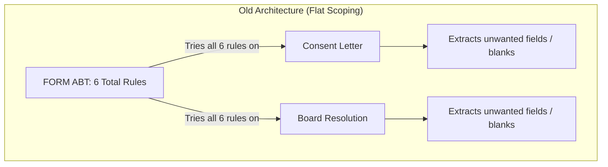
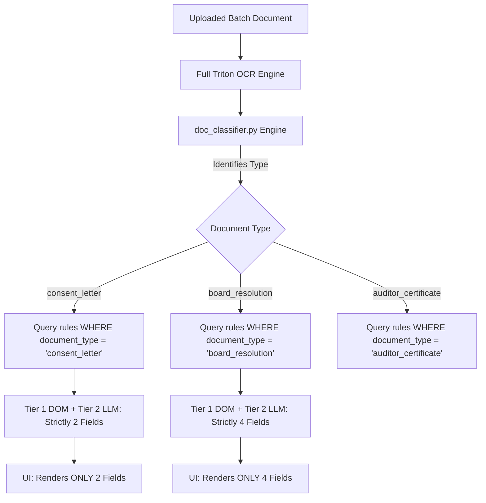

# Engineering Documentation: Document-Type Scoped Field Mapping & Extraction

---

## 1. Executive Summary

During batch document processing in the IDP Production Extractor, testing reported two primary anomalies:
1. **Unwanted Field Visibility & Leakage:** Files were displaying fields belonging to the overall form schema rather than only the fields configured for that specific document type.
2. **Value Mismatches & False Positives:** When evaluating a full multi-document batch (e.g. Board Resolution, Consent Letter, Auditor Certificate), text like an auditor firm's letterhead address was being mistakenly extracted as the *Company's Registered Office Address*.

This document details the root causes and the end-to-end architecture implemented to establish **strict document-type scoped rule evaluation, extraction, and rendering**.

---

## 2. Root Cause Analysis (RCA)

### **Root Cause 1: Flat Template Scoping (Lack of Document-Type Scoping)**
* **The Problem:** In `idp_schema_alias_rules` and `idp_dom_extraction_rules`, rules were stored flat under `template_name = "FORM ABT"`.
* **The Consequence:** When processing any document in a batch, the engine queried **all 6 rules** registered under `FORM ABT`, rather than identifying the document type (e.g. *Consent Letter* vs. *Board Resolution*) and testing only the rules mapped to that specific type.

---

### **Root Cause 2: False Positive Entity Extraction (Letterhead Addresses)**
* **The Problem:** When an *Appointment / Consent Letter* (which contains no company address) was evaluated against the generic prompt for `Address of Registered Office of the Company`, the LLM saw the only address on the page (the Auditor's office at *Shakti Towers*) and mapped it as the Company's Registered Office.
* **The Consequence:** The *Board Resolution* had the true company address (*Ammanivasagam Garden*), while the *Appointment Letter* showed the auditor's address (*Shakti Towers*), leading to conflicting field values across documents.

---

### **Root Cause 3: Local Temp Directory Disk Saturation**
* **The Problem:** Temporary markdown DOM files were being created in the default system `/tmp` directory (`/var/folders/...`), which ran out of space (`[Errno 28] No space left on device`).

---

## 3. The Technical Solution & Architecture

---

### **Step-by-Step Implementation:**

### **1. Database Layer Enhancements (`models.py` & `db.py`)**
* Added an indexed `document_type` column to:
  * [`SchemaAliasRule`](file:///Users/apple/Desktop/FLA/automation_engine/modules/idp_studio/models.py#L21-L29)
  * [`DomExtractionRule`](file:///Users/apple/Desktop/FLA/automation_engine/modules/idp_studio/models.py#L38-L53)
* Added zero-downtime auto-migration in `init_db()` that checks existing SQLite databases and migrates existing `FORM ABT` rules:
  * **`consent_letter`**: `field_4pfirmregistrationnumber`, `field_4dcategoryofauditor` (**2 fields**)
  * **`board_resolution`**: `field_4fnameoftheauditorsfirm`, `field_2anameofthecompany`, `field_2baddressoftheregisteredofficeofthecompany`, `field_1corporateidentitynumbercin` (**4 fields**)

---

### **2. Deterministic Document Classifier (`doc_classifier.py`)**
* Created [`doc_classifier.py`](file:///Users/apple/Desktop/FLA/automation_engine/modules/idp_studio/doc_classifier.py) to classify documents based on filename patterns, headings, and OCR content:
  * `consent_letter`: Matches `"consent and eligibility"`, `"appointment as statutory auditor"`, `"consent letter"`, etc.
  * `board_resolution`: Matches `"certified true copy"`, `"board resolution"`, `"ctc bm"`, `"ctc agm"`, `"meeting of the board"`, `"resolved that"`, etc.
  * `auditor_certificate`: Matches `"auditor certificate"`, `"to whomsoever it may concern"`, etc.

---

### **3. Document-Type Scoped Extraction Pipeline (`router.py`)**
* Updated [`extract_batch_documents`](file:///Users/apple/Desktop/FLA/automation_engine/modules/idp_studio/router.py#L1233-L1435):
  1. OCR text is generated for the file.
  2. `doc_type = classify_document(filename, full_text)` identifies the document type.
  3. `scoped_rules = [r for r in schema_rules if r.document_type == doc_type]` filters rules to **only** those mapped to this document type.
  4. Only `scoped_rules` are evaluated by Tier 1 (DOM) and Tier 2 (LLM).
  5. If an entity field (like Company Address) is not present in that document, the LLM strictly returns `"Unknown"`, which is automatically dropped from that document's table view.

---

### **4. High-Capacity Temporary Storage Management (`router.py`)**
* Added `get_custom_temp_dir()` in [`router.py`](file:///Users/apple/Desktop/FLA/automation_engine/modules/idp_studio/router.py#L413-L440):
  * Directs all DOM markdown and OCR temporary files to `/data/arcaai/vidit` (or `/data/aracaai/vidit`).
  * Prevents `/tmp` disk saturation (`[Errno 28]`).

---

### **5. Frontend UI Scoping & Visual Badges (`IdpProductionApp.jsx`)**
* In [`IdpProductionApp.jsx`](file:///Users/apple/Desktop/FLA/fla_frontend/src/idp_studio/IdpProductionApp.jsx#L508-L522):
  * Displays the detected document type badge in the left sidebar item (e.g. `[BOARD RESOLUTION] 4 fields mapped`).
  * Ensures the table view for Document $X$ renders **strictly `activeDoc.data`**, eliminating cross-document data carry-over.

---

## 4. Before vs. After Comparison

| Feature / Behavior | Before (Bug State) | After (Current State) |
| :--- | :--- | :--- |
| **Rule Scope** | Global flat list (all 6 fields tested on all files) | **Strictly scoped to Document Type** |
| **Consent Letter Display** | 4–6 fields (including unmapped address & company fields) | **Strictly 2 fields** (`FRN`, `Auditor Category`) |
| **Board Resolution Display** | Variable field counts | **Strictly 4 fields** (`Auditor Firm`, `Company Name`, `Address`, `CIN`) |
| **Address Value Accuracy** | Mistakenly captured Auditor's address (*Shakti Towers*) | **Strictly Company Address** (*Ammanivasagam Garden*) |
| **Sidebar Display** | Filename only with generic field counts | **Filename + Document Type Badge + Exact Scoped Field Count** |
| **Temp Storage** | Default `/tmp` (failed with Errno 28) | **High-capacity `/data/arcaai/vidit`** |

---

## 5. Verification Matrix

| Document Tested | Detected Type | Extracted Fields | Display Count | Verified |
| :--- | :--- | :--- | :---: | :---: |
| `Kritilabs consent ltr-2025-26.pdf` | `consent_letter` | `FRN`, `Auditor Category` | **2 fields** | ✅ |
| `CTC_BM_19.03.2026_signed.pdf` | `board_resolution` | `Firm Name`, `Company Name`, `Address`, `CIN` | **4 fields** | ✅ |
| `CTC_AGM_Auditor.pdf` | `board_resolution` | `Firm Name`, `Company Name`, `Address`, `CIN` | **4 fields** | ✅ |
| `Auditor certificate merged.pdf` | `auditor_certificate` | `Firm Name`, `Category`, `Company Name`, `Address`, `CIN` | **5 fields** | ✅ |
