# FLA Automation Platform — High-Level Design (HLD)

## Overview
The FLA (Foreign Liabilities and Assets) Automation Platform is an end-to-end pipeline that ingests company documents, extracts financial data using OCR + parsing, applies RBI-compliant rules, and auto-fills the RBI FLA Return Excel template.

---

## Architecture Diagram

```mermaid
flowchart TD
    subgraph USER["User - CA / Compliance Team"]
        U1(["Upload Documents"])
        U2(["Review Extracted Data"])
        U3(["Download Populated FLA Return"])
    end

    subgraph FRONTEND["React Frontend — fla_frontend"]
        FE1["Upload.jsx\nFile Upload and Company Name"]
        FE2["Dashboard.jsx\nTask Status and Progress Monitor"]
        FE3["TaskView.jsx\nExtracted Data Review Grid"]
        FE4["ComparisonPlatform.jsx\nYoY Comparison Results"]
        FE5["ExcelViewer.jsx\nIn-Browser Excel Preview"]
    end

    subgraph API["FastAPI Backend — api/main.py"]
        API1["POST /api/upload\nSave files, create Task ID"]
        API2["POST /api/process/task_id\nTrigger LangGraph Pipeline"]
        API3["GET /api/tasks/task_id\nPoll Task Status and Logs"]
        API4["POST /api/export/task_id\nRe-evaluate rules and export Excel"]
        API5["GET /api/download/task_id\nServe populated .xlsx file"]
        API6["POST /api/update-excel/task_id\nPatch individual cells post-review"]
        API7["POST /api/platform-compare\nRun YoY comparison module"]
        DB[("SQLite DB\nfla_tasks.db\nExtractionTask")]
    end

    subgraph LANGGRAPH["LangGraph Workflow — engine/workflow/"]
        LG1["Node: ingest\nScan input dir, load manifest\nClassify docs by role"]
        LG2["Node: ocr\nMarker OCR on PDFs\nCache .md output"]
        LG3["Node: extract\nDocumentParser + RuleEngine\nProduce extracted_data + target_cells"]
        LG4["Node: output\nExcelWriter to FLA_Return_Populated.xlsx\nReturnValidator to validation_report.txt"]
        LG5{"check_comparison\nPrevious FLA present?"}
        LG6["Node: compare\nComparisonPlatformManager\nRun YoY delta rules"]
    end

    subgraph INGESTION["Document Ingestion — engine/ingestion.py"]
        IN1["inputs_manifest.json\nExplicit role mapping"]
        IN2["Heuristic Fallback\nFilename keyword matching"]
        IN3["PDF Merger\nMerge multiple financials"]
        IN4["Document Roles\nfinancials, board_report\nshareholders_fdi, odi_details\nextra_details, previous_fla"]
    end

    subgraph OCR["OCR Pipeline — engine/ocr_pipeline.py"]
        OC1["Marker OCR\nmarker_single CLI"]
        OC2["Cache Check\noutput/marker/"]
        OC3["Output: Markdown .md\nStructured text from scanned PDFs"]
    end

    subgraph PARSING["Document Parser — engine/parser.py"]
        PA1["PDF Text Parser\nBalanceSheet and P and L extraction"]
        PA2["Excel Extractor\nShareholders FDI pct\nODI details"]
        PA3["MD / OCR Parser\nParse Marker markdown output"]
        PA4["Text Parser\nBoard report / extra details"]
        PA5["Regex Rules\nShare counts, face values\nfinancial figures"]
        PA6["Consolidated extracted_data dict"]
    end

    subgraph RULES["Rule Engine — engine/rule_engine.py"]
        RE1["rules_config.json\n2000+ cell mappings\nSection I, II, III, IV"]
        RE2["Phase 1: Direct Mapping\nextracted_data to cell_values"]
        RE3["Phase 2: Formula Calculations\nNetworth x NRI pct\nFDI Equity Capital\nOther Capital = Liab minus Claims\nTotals and Aggregations"]
        RE4["Output: target_cells dict\nSection to Cell to Value"]
    end

    subgraph WRITER["Excel Writer — engine/excel_writer.py"]
        EW1["Load Skeletal Template\nFLA Return existing skeletal.xlsx"]
        EW2["Unmerge Target Cells"]
        EW3["Write Values to Sheets\nSection I, II, III, IV"]
        EW4["Handle Multi-Country Blocks\nDynamic FDI and ODI rows"]
        EW5["Save: FLA_Return_Populated.xlsx"]
    end

    subgraph VALIDATOR["Validator — engine/validator.py"]
        VA1["Cross-check Totals\nsum of sub-items = parent"]
        VA2["Mandatory Field Check\nRequired cells not empty"]
        VA3["Save validation_report.txt"]
    end

    subgraph COMPARISON["Comparison Platform — engine/comparison_platform/"]
        CP1["ComparisonPlatformManager"]
        CP2["Load Previous Year FLA Excel"]
        CP3["Run Delta Rules\nFY vs PY checks"]
        CP4["Output: comparison_results list"]
    end

    subgraph DATA_LAYER["File System — data + output"]
        FS1["data/task_id\nUploaded source documents"]
        FS2["output/CompanyName\nFLA_Return_Populated.xlsx\nvalidation_report.txt"]
        FS3["excel\nFLA Return existing skeletal.xlsx\nTemplate file"]
    end

    %% User to Frontend
    U1 --> FE1
    FE1 --> API1
    API1 --> DB
    API1 --> FS1

    FE1 --> API2
    API2 --> LG1

    FE2 --> API3
    API3 --> DB

    FE3 --> API6
    FE3 --> API4
    API4 --> RE4
    API4 --> EW5
    API5 --> U3
    FE2 --> API5

    %% LangGraph Pipeline
    LG1 --> LG2
    LG2 --> LG3
    LG3 --> LG4
    LG4 --> LG5
    LG5 -->|"yes"| LG6
    LG5 -->|"no"| END(["END"])
    LG6 --> END

    %% Ingest internals
    LG1 --> IN1
    LG1 --> IN2
    IN2 --> IN3
    IN1 & IN2 --> IN4

    %% OCR internals
    LG2 --> OC2
    OC2 -->|"not cached"| OC1
    OC1 --> OC3
    OC2 -->|"cached"| OC3

    %% Parse internals
    LG3 --> PA1
    LG3 --> PA2
    LG3 --> PA3
    LG3 --> PA4
    PA1 & PA2 & PA3 & PA4 --> PA5
    PA5 --> PA6

    %% Rule Engine internals
    PA6 --> RE1
    RE1 --> RE2
    RE2 --> RE3
    RE3 --> RE4

    %% Writer internals
    RE4 --> EW1
    EW1 --> FS3
    EW1 --> EW2
    EW2 --> EW3
    EW3 --> EW4
    EW4 --> EW5
    EW5 --> FS2

    %% Validation
    LG4 --> VA1
    VA1 --> VA2
    VA2 --> VA3
    VA3 --> FS2

    %% Comparison
    LG6 --> CP1
    CP1 --> CP2
    CP2 --> FS1
    CP2 --> CP3
    CP3 --> CP4

    %% Comparison UI
    CP4 --> FE4
    FE4 --> U2

    %% Styling
    classDef frontend fill:#4f46e5,color:#fff,stroke:#3730a3
    classDef api fill:#0891b2,color:#fff,stroke:#0e7490
    classDef langgraph fill:#7c3aed,color:#fff,stroke:#6d28d9
    classDef engine fill:#059669,color:#fff,stroke:#047857
    classDef storage fill:#d97706,color:#fff,stroke:#b45309
    classDef user fill:#dc2626,color:#fff,stroke:#b91c1c

    class FE1,FE2,FE3,FE4,FE5 frontend
    class API1,API2,API3,API4,API5,API6,API7,DB api
    class LG1,LG2,LG3,LG4,LG5,LG6 langgraph
    class IN1,IN2,IN3,IN4,OC1,OC2,OC3,PA1,PA2,PA3,PA4,PA5,PA6,RE1,RE2,RE3,RE4,EW1,EW2,EW3,EW4,EW5,VA1,VA2,VA3,CP1,CP2,CP3,CP4 engine
    class FS1,FS2,FS3 storage
    class U1,U2,U3 user
```



---

## Component Summary

| Layer | Technology | Role |
|---|---|---|
| **Frontend** | React + Vite | Upload docs, monitor task, review & export |
| **REST API** | FastAPI + SQLite | Task lifecycle, background job trigger, file serve |
| **Workflow Orchestrator** | LangGraph (StateGraph) | 5-node DAG pipeline with conditional comparison |
| **Document Ingestion** | Python (pypdf) | Classifies docs by role using manifest or heuristics |
| **OCR** | Marker OCR (`marker_single`) | Converts scanned PDFs → structured Markdown |
| **Parser** | Python Regex + pandas | Extracts ~100+ financial fields from multiple doc types |
| **Rule Engine** | Python + rules_config.json | Maps extracted fields → Excel cells with formulas |
| **Excel Writer** | openpyxl | Populates FLA skeletal template with computed values |
| **Validator** | Python | Cross-checks totals, mandatory fields |
| **Comparison** | Python | Year-over-Year delta analysis against prior FLA |

---

## Key Data Flows

### 1. Document Input Roles
```
financials         → Balance Sheet, P&L (PDF/MD)
board_report       → Board Report PDF
shareholders_fdi   → List of Shareholders Excel (FDI %)
odi_details        → ODI Mapping Excel (DIE details)
extra_details      → Manual Block 4 inputs (Excel/MD)
previous_fla_*     → Prior year FLA Return (triggers comparison)
```

### 2. Key Formula Chain (Section III)
```
NRI Equity %  (from shareholders_fdi Excel)
    ↓
Net Worth     (from Balance Sheet via parser)
    ↓
Equity Capital Holding = Net Worth × NRI %
    ↓
1.1 Liabilities to Direct Investors = Equity Capital Holding
    ↓
Other Capital = Liabilities (2.1) − Claims (2.2)
```

### 3. FLA Return Structure Populated
```
Section I   → Company & Reporting Period details
Section II  → Financial data (Assets, Liabilities, Net Worth)
Section III → FDI Inward (Block 1: ≥10%, Block 2: <10%)
Section IV  → ODI Outward (DIE blocks, Portfolio, Unrelated)
```
