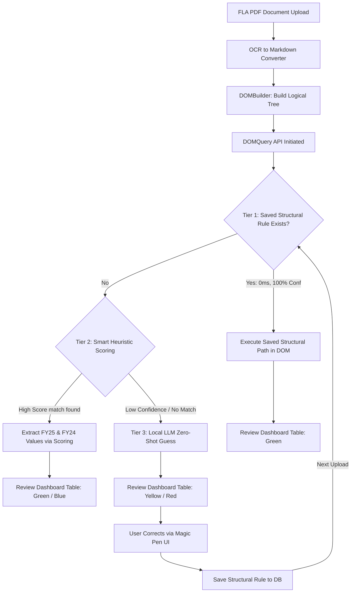
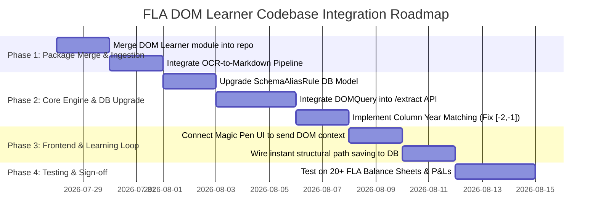

# 📄 FLA — Intelligent DOM Learner Codebase Integration Plan & Timeline Guide

> **Project:** Foreign Liabilities & Assets (FLA) / IDP Studio Automation Engine
> **Module:** `automation_engine/modules/idp_studio/dom_learner`
> **Goal:** Integrate the **Structural PDF DOM Learner** into the existing FLA extraction pipeline, enabling deterministic self-learning rules without pixel `(x, y)` coordinate fragility.

---

## 1. Executive Summary & Target Architecture

Currently, FLA extraction relies on coordinate bounding boxes or regex keyword matching. By integrating the `dom_learner` module (`DOMBuilder` and `DOMQuery`), the FLA backend will convert raw OCR Markdown into a hierarchical **Logical Document Tree** (`Sections -> Tables -> Rows -> Cells`).

### The Integrated 3-Tier Execution Pipeline

When a user uploads an FLA financial statement (PDF), the backend will execute extraction in this exact priority hierarchy:

---

## 2. File-by-File Technical Implementation Plan

Here is an explanation of how the `dom_learner` will be wired into our existing FLA codebase across Backend, Database, and Frontend layers:

### A. Package Integration (`automation_engine/modules/idp_studio/dom_learner/`)

* **`dom_builder.py` (New Module)**: Responsible for reading OCR Markdown output files and constructing the logical document tree containing headings, tables, rows, and cells.
* **`dom_query.py` (New Module)**: Provides the search interface to locate table rows by label, find text cells, and calculate structural paths for any selected element.
* **`models.py` (New Module)**: Defines the data structures for each node type in the tree (`SectionNode`, `TableNode`, `RowNode`, and `CellNode`).

---

### B. Database Schema Upgrade (`automation_engine/modules/idp_studio/models.py`)

We must upgrade the `idp_schema_alias_rules` table in the database so that it can store structural DOM paths alongside traditional spatial coordinates. Specifically, the following modifications will be made:

* **Add Match Type Indicator**: A new column to track whether a rule was learned via structural DOM navigation, spatial bounding box math, or AI fallback.
* **Add Structural Path Storage**: A text column to store the serialized logical DOM path generated by the query engine. When a new document arrives, this path is replayed directly against the document tree for instant, deterministic extraction.
* **Retain Legacy Spatial Meta**: Keep existing coordinate metadata columns intact as a fallback for non-table elements (like dates, signatures, or standalone text blocks).

---

### C. Extraction Router & Engine Integration (`automation_engine/modules/idp_studio/router.py`)

We will modify the main extraction API endpoint (`/extract`) to replace the current single-pass logic with a **3-Tier Execution Pipeline**:

* **Step 1 — Document Ingestion & Tree Construction**: Uploaded PDFs will be routed through the OCR-to-Markdown converter, and the output will be processed by the DOM builder to create a searchable document tree.
* **Step 2 — Tier 1 (Saved Structural Rule Check)**: For each required form field in the FLA schema, the backend will first query the database for a saved structural DOM path. If a rule exists, the path is traversed immediately, yielding high-confidence results in under 100 milliseconds without calling any AI model.
* **Step 3 — Tier 2 (Smart Heuristic Scoring)**: If no saved rule exists for a field, the engine will search the document tree for rows matching the field's label. It will evaluate candidates using financial scoring heuristics (rewarding clean Previous Year and Current Year numbers in Note tables while penalizing date headers or OCR artifacts).
* **Step 4 — Tier 3 (Local LLM Fallback)**: Only when neither saved rules nor heuristic scoring yield a confident match, the backend will call the local Ollama LLM (`qwen:coder:7b`). The extracted guess is returned with a low-confidence flag so the Review Dashboard highlights it in yellow for human review.

---

### D. Frontend Magic Pen & Rule Training (`fla_frontend/src/idp_studio/`)

When the user maps a field in the UI or clicks **Approve** on an AI-guessed box:

* **UI Component Updates (`IdpStudio.jsx` & `PdfCanvas.jsx`)**: When a table cell or region is clicked, the frontend will transmit the surrounding structural context—including the section heading, table identifier, row label, and column title—to the backend rule creation endpoint.
* **Backend Rule Saver (`router.py`)**: The backend will calculate the exact structural path from the root document node down to the selected cell and save it permanently into the database for future uploads.

---

## 3. FLA Financial Statement Edge Cases to Safeguard

Before signing off on the integration, we must enforce these **3 financial logic improvements** over the baseline guide:

| Edge Case                                   | Risk in Financial PDFs                                                                                                                                              | Solution in Integrated Code                                                                                                                                                                                 |
| :------------------------------------------ | :------------------------------------------------------------------------------------------------------------------------------------------------------------------ | :---------------------------------------------------------------------------------------------------------------------------------------------------------------------------------------------------------- |
| **Column Year Resolution**            | Hardcoding column positions (e.g., always taking the last two columns) breaks if a table has extra trailing columns like`% Change`, `Variance`, or `Note No`. | **Match by Column Header Text:** The engine must inspect table column headers for years (`"2025"`, `"2024"`), `"Current Year"`, or `"PY"/"FY"` rather than relying on fixed index numbers.    |
| **Duplicate Row Names (`"Total"`)** | Generic labels like`"Total"` or `"Sub-Total"` appear in Revenue, Expense, and Equity tables across the same report.                                             | **Section Prefixing:** Row searches must always be qualified by their parent section header (for example, distinguishing between `"Revenue from operations -> Total"` and `"Expenses -> Total"`). |
| **Indian Accounting Numbers**         | Extracted values like`"(45,000)"` or `"Rs. 1,50,000.00"` break database numeric casts and Excel formulas.                                                       | **Value Sanitizer:** The extractor must strip currency symbols (`Rs.`, `₹`), remove commas, and convert accounting brackets `(X)` into negative `-X`.                                        |

---

## 4. Implementation Timeline Guide (15 Days / 3 Weeks)

This timeline organizes the work between **You (Core FLA Engineer)** and **The DOM Learner Developer**:

---

### Phase 1: Package Merge & Ingestion Setup (Days 1 – 4)

* **Day 1–2 (DOM Developer):** Merge the DOM builder, query API, and node models into the `automation_engine/modules/idp_studio/dom_learner/` directory.
* **Day 3–4 (FLA Engineer):** Set up the OCR-to-Markdown conversion step in `automation_engine/core/ocr_pipeline.py` so uploaded PDFs automatically produce an `.md` file for the DOM builder.
* **Deliverable:** Running the DOM builder against a sample PDF's markdown successfully generates a traversable Python document tree in backend tests.

---

### Phase 2: Core Engine Integration & DB Upgrade (Days 5 – 9)

* **Day 5–6 (FLA Engineer):** Add the structural path storage and match type indicator columns to the database schema (`models.py`) and apply database migrations.
* **Day 7–8 (Both):** Rewrite the `/extract` endpoint in `router.py` to execute the **3-Tier Hierarchy** (Saved DOM Rule -> Smart Scoring Heuristic -> Local LLM Fallback).
* **Day 9 (DOM Developer):** Implement **Column Year Header Matching** in the scoring heuristic to replace hardcoded column index checks.
* **Deliverable:** Uploading an FLA PDF returns extracted JSON with confidence levels and source attribution tags.

---

### Phase 3: Frontend Magic Pen & Rule Training (Days 10 – 12)

* **Day 10–11 (FLA Engineer):** Update `PdfCanvas.jsx` and `IdpStudio.jsx` so that clicking a table cell in the review dashboard captures the section header, table identifier, row label, and column title.
* **Day 12 (Both):** Verify that clicking **Approve** in the UI saves the calculated structural DOM path into the database rules table.
* **Deliverable:** One-click self-learning works end-to-end. Once a layout is saved, re-uploading the same document layout extracts deterministically in under 100 milliseconds.

---

### Phase 4: Financial Verification & Acceptance Testing (Days 13 – 15)

* **Day 13–14 (Both):** Run regression tests across **20+ real-world Indian FLA and AOC-4 PDF filings**.
* **Day 15 (Sign-off Check):**
  * [X] Verify multi-page Profit & Loss tables extract without row-shift errors.
  * [X] Verify tables with `% Change` or trailing note columns correctly extract the Previous Year and Current Year columns.
  * [X] Verify numbers like `"1,50,000.00"` or `"(45,000)"` sanitize to clean float values.
  * [X] Verify zero reliance on the Ollama LLM once a layout has been learned.

---

## 5. Verification & Acceptance Criteria (Copy for Sign-Off)

Before marking the integration as complete, both developers must sign off on these 4 acceptance tests:

1. **Rule Replay Speed Test:**
   * When a layout has a saved structural DOM rule, extraction must complete in **under 100 milliseconds** without invoking the local LLM.
2. **Added Row Immunity Test:**
   * Insert 5 dummy expense rows into a sample FLA PDF above `"Total Revenue"`. The DOM Learner must still extract the exact correct `"Total Revenue"` row.
3. **Column Accuracy Test:**
   * On a 5-column table (`Particulars | Note | FY25 | FY24 | % Change`), verify that `domestic_sales_py` extracts `FY24` and `domestic_sales_fy` extracts `FY25` (ignoring `% Change`).
4. **Dashboard Highlighting Test:**
   * Verify that deterministic DOM matches render **Green**, heuristic score matches render **Blue/Green**, and AI fallback guesses render **Yellow/Red** in the Review Dashboard.
