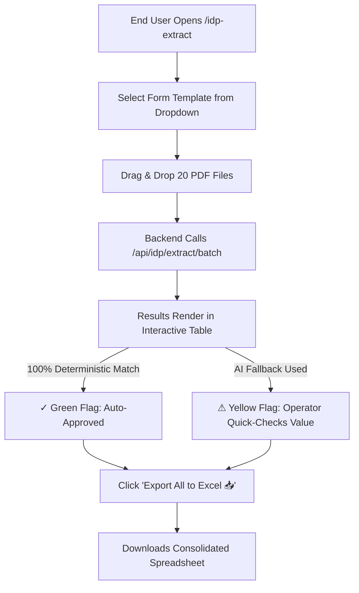

# 🚀 IDP Production Extraction Screen (`/idp-extract`) — Implementation Plan

> **Project:** Foreign Liabilities & Assets (FLA) / IDP Studio Automation Engine  
> **Module:** `fla_frontend/src/idp_studio`  
> **Goal:** Create a clean, end-user-facing **Production Extraction Dashboard** at `/idp-extract` with zero mapping tools, allowing operators to select a template, upload batch PDFs, and export extracted data to Excel/JSON.

---

## 1. Visual Wireframe & User Flow

### A. End-User 3-Step UI Mockup
```
+----------------------------------------------------------------------------------------------------+
|  [📄 IDP Production Extractor]     Template: [ FLA Balance Sheet ▼ ]     [ Export All to Excel 📥 ] |
+----------------------------------------------------------------------------------------------------+
|                                                                                                    |
|   +---------------------------------------+   +------------------------------------------------+   |
|   |         STEP 1: BATCH UPLOAD          |   |          STEP 2: EXTRACTED RESULTS             |   |
|   |                                       |   |                                                |   |
|   |    [  Drag & Drop up to 50 PDFs  ]    |   |  Document         Status    Net Worth    PY     |   |
|   |    [      Browse Files...        ]    |   |  --------------------------------------------- |   |
|   |                                       |   |  Tata_FLA.pdf      [✓]      150,000    120,000 |   |
|   |  Uploaded Queue:                      |   |  Reliance_FLA.pdf  [⚠]      450,000    380,000 |   |
|   |  1. Tata_FLA.pdf             [✓]      |   |  Infosys_FLA.pdf   [✓]      210,000    195,000 |   |
|   |  2. Reliance_FLA.pdf         [⚠]      |   |                                                |   |
|   |  3. Infosys_FLA.pdf          [✓]      |   |  [+ Click Yellow row to inspect/edit values ]  |   |
|   +---------------------------------------+   +------------------------------------------------+   |
|                                                                                                    |
+----------------------------------------------------------------------------------------------------+
```

### B. User Flow Diagram


---

## 2. Technical Component Architecture

### A. [NEW] [IdpProductionApp.jsx](file:///Users/apple/Desktop/FLA/fla_frontend/src/idp_studio/IdpProductionApp.jsx)
A standalone React screen at `/idp-extract` containing:
1. **Header Bar:**  
   - Template Selector Dropdown (fetches from `/api/idp/templates`).
   - "Export to Excel" & "Export to JSON" buttons.
   - Quick navigation switch back to `/idp-studio` for administrators.
2. **Left Panel (Upload Dropzone & Queue):**  
   - Multi-file dropzone (`multiple={true}`).
   - Uploaded document queue with status badges (`✓ Green`, `⚠ Yellow`, `⏳ Loading`).
3. **Right Panel (Results Table & Review):**  
   - Tabular view of all extracted documents and their key-value pairs.
   - Allows quick manual inline correction of any `⚠ Yellow` field before export.

---

### B. [MODIFY] [App.jsx](file:///Users/apple/Desktop/FLA/fla_frontend/src/App.jsx)
1. Register `<Route path="/idp-extract" element={<IdpProductionApp />} />`.
2. Add a global navigation link in the top header:
   ```jsx
   <a href="/idp-extract" className="...">IDP Production Extractor</a>
   <a href="/idp-studio" className="...">IDP Schema Studio</a>
   ```

---

### C. [MODIFY] [idpClient.js](file:///Users/apple/Desktop/FLA/fla_frontend/src/idp_studio/api/idpClient.js)
1. Add `exportToExcel(batchResults, filename)` helper to trigger spreadsheet download in the browser.

---

## 3. Verification Plan
1. **Route Test:** Visit `http://localhost:5173/idp-extract` and confirm the new Production Extractor loads without any Magic Pen or drawing tools.
2. **Batch Upload Test:** Upload 3 PDFs and verify they process through `/api/idp/extract/batch` and populate the results table.
3. **Excel Export Test:** Click **Export All to Excel** and confirm a valid spreadsheet containing all 3 documents' extracted data is downloaded.
