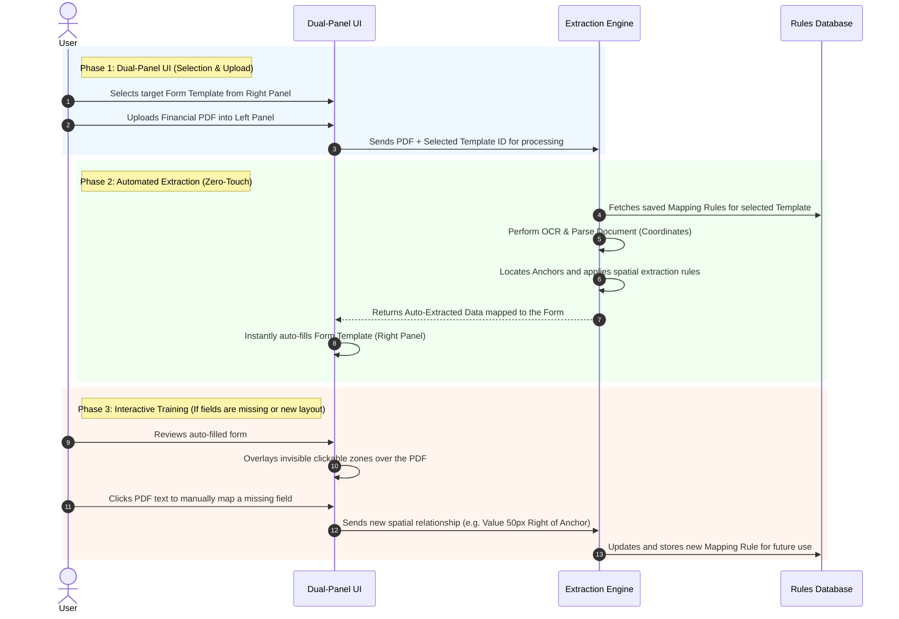
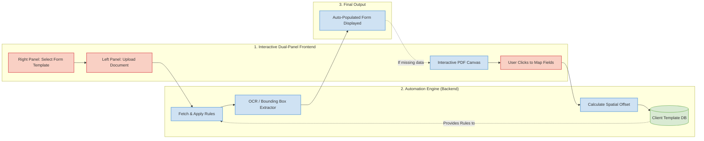

# Intelligent Document Processing (IDP) Workflow

Here is a comprehensive breakdown of the Human-in-the-Loop system. It is highly recommended to use **all three diagrams** when explaining this system, as they cover both the user experience and the evolution of the technical architecture:

* **Diagram 1 (Sequence Diagram):** Explains the **User Experience** and chronological timeline.
* **Diagram 2 (Initial Setup Architecture):** Explains the **Traditional Flow**, where a client's document is mapped manually the very first time to train the database.
* **Diagram 3 (Automated Architecture):** Explains the **Final Automated Flow**, where the dual-panel UI fetches the trained rules first and auto-populates the form instantly.

---

### 1. Step-by-Step Interaction Sequence

 

### 2. Initial Setup Flow (First-Time Client Mapping)

This diagram shows the initial state of the system when a new client's document is uploaded for the very first time. The data flows sequentially through the manual mapping UI before being saved to the database.

```mermaid
flowchart LR
    %% Styling definitions
    classDef userAction fill:#f9d0c4,stroke:#e06666,stroke-width:2px,color:#333;
    classDef systemProc fill:#cfe2f3,stroke:#6fa8dc,stroke-width:2px,color:#333;
    classDef dataStore fill:#d9ead3,stroke:#93c47d,stroke-width:2px,color:#333;

    %% Nodes
    UserUpload["User Uploads Document"]:::userAction
  
    subgraph Extraction["1. Extraction Engine"]
        direction TB
        OCR["OCR / PDF Parsing"]:::systemProc
        BBoxes["Extract Text & Bounding Boxes"]:::systemProc
    end
  
    subgraph UI["2. Interactive Mapping (Frontend)"]
        direction TB
        Canvas["Render PDF Canvas"]:::systemProc
        MapClick["User Maps Anchor to Value"]:::userAction
        CalcOffset["Calculate Spatial Offset"]:::systemProc
    end
  
    subgraph Auto["3. Automation Engine (Backend)"]
        direction TB
        RulesDB[("Client Template DB")]:::dataStore
        TemplateMatch["Template Matching Engine"]:::systemProc
        AutoFill["Auto-Populated Form Output"]:::systemProc
    end

    %% Connections
    UserUpload --> OCR
    OCR --> BBoxes
    BBoxes --> Canvas
    Canvas --> MapClick
    MapClick --> CalcOffset
    CalcOffset --> RulesDB
  
    UserUpload -. "Next Year's Upload" .-> TemplateMatch
    RulesDB --> TemplateMatch
    TemplateMatch --> AutoFill
```

 

### 3. Final Automated Flow (Dual-Panel UI)

This diagram shows the final, optimized state of the system. By selecting the form template upfront, the system retrieves the rules from the database *first*, automating the extraction process entirely. The manual mapping is only used as a fallback if data is missing.

