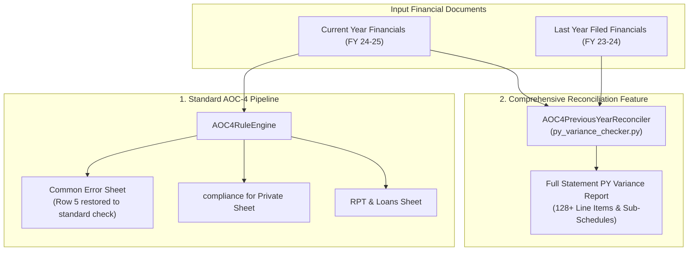

# Financial Statement Line Items & Comprehensive Reconciliation Documentation (AOC-4)

This document provides a complete reference for all financial statement line items, sub-schedules, and reconciliation capabilities covered in the **AOC-4 Automation Engine**.

---

## 1. Overview & Architecture

The AOC-4 engine handles two distinct layers:
1. **Standard Compliance & Error Checking:** Generates the standard `Common Error`, `compliance for Private `, and `RPT and loans to Director` sheets in the populated AOC-4 template.
2. **Comprehensive Full-Statement Reconciliation (Dedicated Feature):** Cross-reconciles **every line item and sub-line item** between the Current Year Financials (Previous Year comparative column) and the actual Last Year Filed Financials, producing an itemized **Exception / Variance Report**.

---

## 2. Complete Scope of Covered Line Items & Sub-Line Items

### A. Balance Sheet (Primary Financial Statement)
| Major Category | Line Items & Sub-Line Items Covered |
| :--- | :--- |
| **Shareholders' Funds** | • Share Capital • Reserves & Surplus • Net Worth ($\text{PUC} + \text{Reserves}$) |
| **Non-Current Liabilities** | • Long-Term Provisions • Long-Term Borrowings • Other Long-Term Liabilities |
| **Current Liabilities** | • Trade Payables (Dues to MSME) • Trade Payables (Dues to Other Creditors) • Other Current Liabilities • Short-Term Provisions • Short-Term Borrowings |
| **Total Equity & Liabilities** | • Total Balance Sheet Size (Liabilities Side) |
| **Non-Current Assets** | • Property, Plant & Equipment (PPE) • Intangible Assets • Other Non-Current Assets • Non-Current Investments |
| **Current Assets** | • Trade Receivables • Cash and Cash Equivalents • Short-Term Loans & Advances • Other Current Assets • Current Investments |
| **Total Assets** | • Total Balance Sheet Size (Assets Side) |

---

### B. Statement of Profit & Loss (Primary Financial Statement)
| Category | Line Items & Sub-Line Items Covered |
| :--- | :--- |
| **Incomes** | • Revenue from Operations • Other Income • Total Revenue / Total Income |
| **Expenses** | • Employee Benefits Expense • Finance Costs / Interest Expenses • Depreciation & Amortization Expense • Other Expenses • Total Expenses |
| **Profitability & Tax** | • Profit Before Exceptional Items & Tax • Profit Before Tax (PBT) • Current Tax Expense • Deferred Tax Expense / Provision • Total Profit / (Loss) for the Period (PAT) |
| **Per Share Figures** | • Basic Earnings Per Share (EPS in INR) • Diluted Earnings Per Share (EPS in INR) |

---

### C. Notes to Accounts & Sub-Schedules (100% Granular Coverage)

#### 1. Share Capital Schedule (Note 3)
* Authorised Share Capital (Equity & Preference)
* Issued, Subscribed and Paid-Up Share Capital
* Reconciliation of Shares at beginning vs end of period
* Shares held by Holding Company / Ultimate Holding Company
* Major Shareholders holding more than 5% / 10%
* Promoters' Shareholding details

#### 2. Trade Payables Ageing Schedule (Note 6)
* Undisputed Dues to MSME
* Undisputed Dues to Others
* Disputed Dues to MSME / Others
* Ageing Brackets:
  * Not Due / Unbilled
  * Less than 1 Year
  * 1 – 2 Years
  * 2 – 3 Years
  * More than 3 Years

#### 3. Other Current Liabilities Schedule (Note 7)
* Advances received from customers
* Payables to employees (Salaries / Bonuses accrued)
* Statutory Dues (PF, ESI, TDS, GST payable)
* Income Tax Payable (Net of advance tax)

#### 4. Provisions Schedules (Notes 5 & 8)
* Long-Term Provision for Compensated Absences
* Long-Term Provision for Gratuity (Net)
* Short-Term Provision for Expenses
* Short-Term Provision for Employee Benefits

#### 5. Tangible & Intangible Assets Schedule (Notes 9 & 10)
* Property, Plant and Equipment Gross Block / Net Block
* Intangible Assets Gross Block / Net Block
* Depreciation of PPE during the year
* Amortization of Intangible Assets
* Impairment of Goodwill / Assets

#### 6. Trade Receivables Ageing Schedule (Note 11)
* Undisputed Trade Receivables — considered good
* Undisputed Trade Receivables — considered doubtful
* Disputed Trade Receivables
* Ageing Brackets:
  * Not Billed
  * Not Due
  * Less than 6 Months
  * 6 Months – 1 Year
  * 1 – 2 Years
  * 2 – 3 Years
  * More than 3 Years

#### 7. Cash & Bank Balances (Note 12)
* Balances in Current Accounts with Scheduled Banks
* Balances in Fixed Deposit Accounts (Term Deposits)
* Cash on Hand

#### 8. Loans, Advances & Other Current/Non-Current Assets (Notes 10, 13, 14)
* Prepaid Expenses (Unsecured, considered good)
* GST Input Tax Credit / Balances with Government Authorities
* Advances paid to suppliers & creditors
* Income Tax Refund Receivable
* Insurance Wallet
* Other Recoverable amounts (Gross)
* Less: Provision for Doubtful Recoverables

#### 9. Other Income Breakdown (Note 16)
* Interest Income on Fixed Deposits
* Net Gain on Foreign Exchange Fluctuations
* Rental Income
* Miscellaneous Incomes

#### 10. Other Expenses Breakdown (Note 20)
* Professional & Legal Charges
* Facility Costs, Repairs & Maintenance
* Rates and Taxes
* Recruitment and Hiring Charges
* Telephone & Internet Charges
* Office & Administrative Expenses

#### 11. Employee Benefits & Actuarial Valuation (Note 17)
* Defined Benefit Obligation at beginning of year
* Current Service Cost
* Interest Cost on Obligation
* Benefits Settled / Paid
* Actuarial (Gain) / Loss on Obligations
* Fair Value of Plan Assets at beginning vs end of year
* Interest Income on Plan Assets
* Remeasurement / Return on Plan Assets
* Net Defined Benefit Liability / Asset
* Past Service Cost (Vested / Unvested)
* Net Gratuity Cost / Leave Encashment recognized in P&L

#### 12. Related Party Transactions & Balances
* Entity-by-entity transaction amounts during the year
* Year-end outstanding balances (Payables / Receivables) with related entities and Directors

#### 13. Foreign Exchange & Disclosures
* Earnings in Foreign Currency (Export of services / turnover)
* Expenditure in Foreign Currency (Travel, professional fees, software)
* Contingent Liabilities (GST / Income Tax demand orders)

---

## 3. Code Modules Reference

| File Path | Component | Role |
| :--- | :--- | :--- |
| [`automation_engine/modules/aoc4/py_variance_checker.py`](file:///Users/apple/Desktop/FLA/automation_engine/modules/aoc4/py_variance_checker.py) | `AOC4PreviousYearReconciler` | **Main Reconciliation Engine:** Parses 100% of Financial Statement tables and generates the full line-by-line Exception/Variance report. |
| [`automation_engine/modules/aoc4/parser.py`](file:///Users/apple/Desktop/FLA/automation_engine/modules/aoc4/parser.py) | `AOC4Parser` | Extracts primary & comparative financial values (`prev_<key>`), unit multipliers, holding status, and IND-AS status. |
| [`automation_engine/modules/aoc4/aoc4_error_checker.py`](file:///Users/apple/Desktop/FLA/automation_engine/modules/aoc4/aoc4_error_checker.py) | `AOC4CommonErrorEngine` | Standard AOC-4 Common Error evaluator (Rows 1–39), decoupled and untouched. |
| [`automation_engine/modules/aoc4/rule_engine.py`](file:///Users/apple/Desktop/FLA/automation_engine/modules/aoc4/rule_engine.py) | `AOC4RuleEngine` | Master coordinator that populates Excel sheets (`Common Error`, `compliance for Private `, `RPT`). |

---

## 4. Guarantee of Zero Disruption

> [!NOTE]
> The Full Financial Statement Reconciliation feature runs as an **independent service/module**. It operates on the raw text/tables without modifying or overwriting any cells in the standard `Common Error`, `compliance for Private `, or `RPT and loans to Director` sheets.
