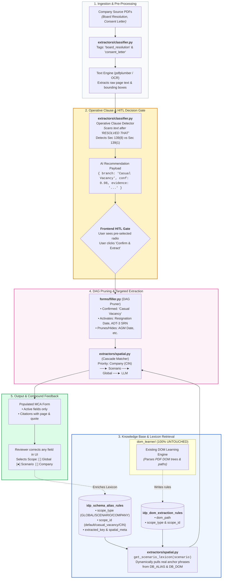
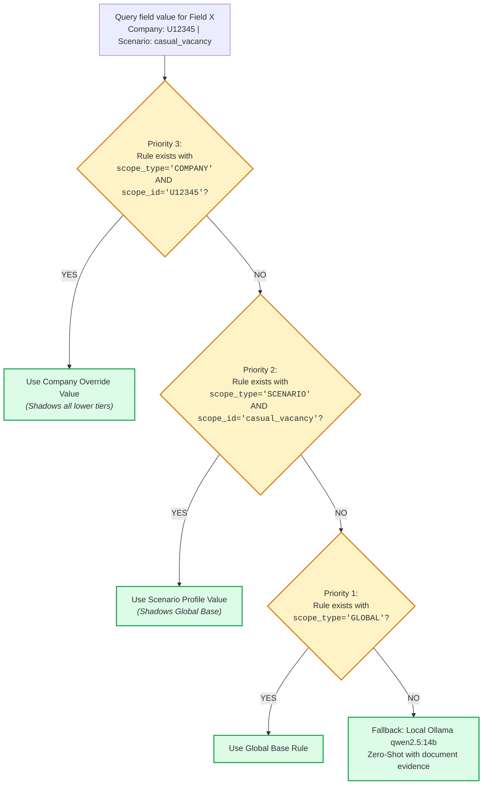
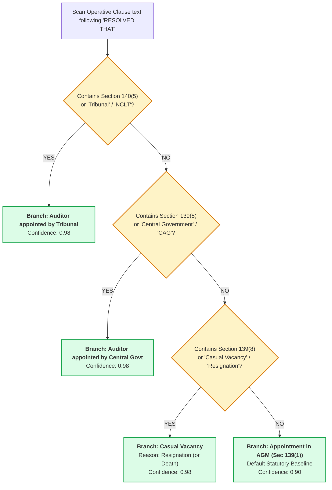
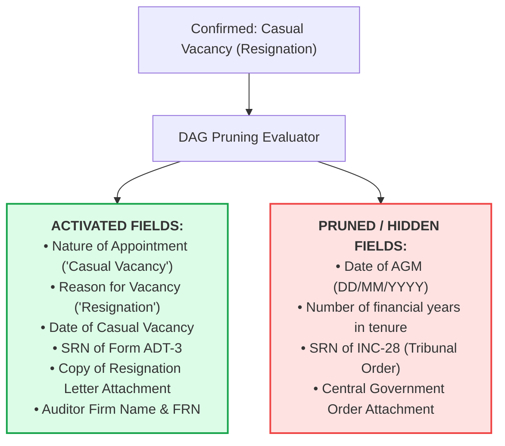

# Comprehensive Technical Implementation Plan: Multi-Tenant Scoped Extraction & Data-Driven Dynamic Form Engine

**Module:** IDP Studio & Extractor App (`automation_engine/modules/idp_studio`)  
**Target:** 54+ MCA Form Schemas (ADT-1, AOC-4, MGT-7, Form 8) & RBI FLA  
**Constraint:** `automation_engine/modules/idp_studio/dom_learner/` remains **100% UNTOUCHED** (Zero code changes).  
**Status:** Ready for Review & Execution  

---

## 1. Executive Summary & Core Architectural Pillars

This architecture solves the multi-tenant form filling challenge across 50+ companies filing identical MCA forms (such as Form ADT-1) under different statutory scenarios (AGM 5-year reappointment, Casual Vacancy due to resignation, Casual Vacancy due to death, Tribunal order, Joint Auditors).

```text
┌──────────────────────────────────────────────────────────────────────────────────────────────────┐
│                                 THE FOUR CORE ARCHITECTURAL PILLARS                              │
│                                                                                                  │
│  1. 3-Tier Hierarchical Scoping     : Global Base ──► Scenario Archetype ──► Company Override    │
│  2. Data-Driven Keyword Harvesting  : Learn real-world drafting phrases from DOM Learner & UI   │
│  3. Upfront HITL Decision Gate      : AI recommends branch; 1-click human verification           │
│  4. Deterministic DAG Tree Pruning  : Activates relevant branch; hides 100% of irrelevant fields │
└──────────────────────────────────────────────────────────────────────────────────────────────────┘
```

---

## 2. End-to-End System Topology & Connections

The following diagram illustrates how all modules, database tables, and the untouched `dom_learner` interact seamlessly:



---

## 3. The 3-Tier Scoping & Shadowing Algorithm

### 3.1 Tier Structure
1. **Tier 1: Global Base Schema (`scope_type = 'GLOBAL'`, `priority = 1`)**
   - Official MCA form definition (field IDs, types, DAG conditional dependencies).
   - Captured **ONCE** from the Instruction Kit PDF. Shared by all companies.
2. **Tier 2: Scenario Archetype Profiles (`scope_type = 'SCENARIO'`, `priority = 2`)**
   - Shared legal pathway rules (e.g. `casual_vacancy`, `agm_appointment`, `tribunal_order`).
   - Stores real-world secretarial phrasing learned from filings under this scenario.
3. **Tier 3: Company-Specific Overrides (`scope_type = 'COMPANY'`, `priority = 3`)**
   - Scoped strictly to Company CIN (e.g. `U72200DL2020PTC123456`).
   - Stores proprietary letterhead $(X, Y, W, H)$ bounding boxes or custom firm names.

### 3.2 Shadowing Resolution Logic



---

## 4. Data-Driven Keyword Harvesting (From DOM Learner & UI)

### 4.1 Why No Hardcoded Keyword Dictionaries?
Hardcoding dictionaries in Python introduces human bias, misses regional secretarial synonyms, and requires code deployments whenever phrasing changes.

### 4.2 How the Dynamic Harvester Works
When an operator maps a field in IDP Studio:
1. The user clicks on the document text in the frontend UI.
2. The UI / DOM Learner captures:
   - **`extracted_key`:** The exact text label highlighted (e.g., `"Date of cessation of statutory auditor"`).
   - **`anchor_text`:** The nearest heading or label.
   - **`dom_path`:** The structural DOM path (e.g., `section(1) -> table(2) -> row(3) -> label(...)`).
3. This is saved to SQLite with:
   - `scope_type = 'SCENARIO'`
   - `scope_id = 'casual_vacancy'`
4. **When Company 2 files under Casual Vacancy:**
   The function `get_scenario_lexicon('ADT-1', 'casual_vacancy')` executes:
   ```sql
   SELECT DISTINCT extracted_key FROM idp_schema_alias_rules 
   WHERE template_name = 'ADT-1' 
     AND (scope_type = 'GLOBAL' OR (scope_type = 'SCENARIO' AND scope_id = 'casual_vacancy'));
   ```
   **The system automatically searches for `"Date of cessation of statutory auditor"` without any developer writing code!**

---

## 5. Operative Clause Analysis & Precedence Matrix

### 5.1 Legal Principle
Under Indian Secretarial Standards (SS-1), historical recitals (*"WHEREAS..."*) are ignored. Only the **Operative Clause** (starting with `"RESOLVED THAT"`) carries statutory force.

### 5.2 Precedence Evaluation Hierarchy



---

## 6. The Upfront HITL Decision Gate

Before running heavy OCR and field extraction, the user confirms the branch in an upfront interactive modal:

```text
┌────────────────────────────────────────────────────────────────────────┐
│  Confirm Statutory Filing Branch                                       │
│                                                                        │
│  ○ Appointment / Re-appointment in AGM (Sec 139(1))                    │
│                                                                        │
│  ● Casual Vacancy (Sec 139(8))   [✓ AI Detected - 98% Confidence]      │
│    └─ Evidence: "RESOLVED THAT pursuant to Section 139(8)... fill the  │
│                 casual vacancy caused by resignation of M/s ABC & Co"  │
│                                                                        │
│  ○ Auditor appointed by Tribunal (Sec 140(5))                          │
│  ○ Auditor appointed by Central Government (Sec 139(5))                │
│                                                                        │
│                    [ Confirm Branch & Extract Data → ]                 │
└────────────────────────────────────────────────────────────────────────┘
```

* **95% of cases:** User glances at the recommendation and clicks **Confirm** (1 second).
* **Edge cases:** User flips the radio button in 1 click; the system immediately aligns to their choice.

---

## 7. Deterministic DAG Tree Pruning

Once the branch is confirmed, `forms/filler.py` executes DAG pruning. Fields with unmet `depends_on` conditions are set to `is_active = False` and pruned:



---

## 8. Exact File-by-File Implementation Steps

### 8.1 Core Layer: Database & Models

#### File: [`automation_engine/modules/idp_studio/core/models.py`](file:///Users/apple/Desktop/FLA/automation_engine/modules/idp_studio/core/models.py)
* Add `scope_type = Column(String, index=True, default="GLOBAL")`
* Add `scope_id = Column(String, index=True, default="default")`
* Add `priority = Column(Integer, default=1)`
* Apply to both `SchemaAliasRule` and `DomExtractionRule`.

#### File: [`automation_engine/modules/idp_studio/core/db.py`](file:///Users/apple/Desktop/FLA/automation_engine/modules/idp_studio/core/db.py)
* In `init_db()`, add automatic SQLite schema migration:
  * Check existing columns via `PRAGMA table_info`.
  * Execute safe `ALTER TABLE ADD COLUMN` for `scope_type`, `scope_id`, and `priority`.
  * Ensure existing records default to `GLOBAL` and `default`.

---

### 8.2 Extractors Layer: Classification, Lexicon & Cascade

#### File: [`automation_engine/modules/idp_studio/extractors/classifier.py`](file:///Users/apple/Desktop/FLA/automation_engine/modules/idp_studio/extractors/classifier.py)
* Add `detect_operative_statutory_branch(text: str) -> Dict[str, Any]`:
  * Regex search for `"RESOLVED THAT"` operative clause.
  * Statutory section precedence matching (`140(5) > 139(5) > 139(8) > 139(1)`).
  * Returns `{ recommended_branch, confidence, evidence_snippet, source_page }`.

#### File: [`automation_engine/modules/idp_studio/extractors/spatial.py`](file:///Users/apple/Desktop/FLA/automation_engine/modules/idp_studio/extractors/spatial.py)
* Add `get_scenario_lexicon(template_name: str, scenario: str) -> Dict[str, List[str]]`:
  * Queries `idp_schema_alias_rules` and `idp_dom_extraction_rules` for all distinct `extracted_key` and DOM labels matching the scenario or global scope.
* Add `get_effective_rules(template_name, company_id=None, scenario=None) -> Dict[str, SchemaAliasRule]`:
  * Implements `priority DESC` shadowing (Company > Scenario > Global).

---

### 8.3 Forms Layer: Dynamic Filler & DAG Pruner

#### File: [`automation_engine/modules/idp_studio/forms/filler.py`](file:///Users/apple/Desktop/FLA/automation_engine/modules/idp_studio/forms/filler.py)
* Update `fill_form()`:
  * Accept `context: Optional[Dict[str, Any]] = None` containing `{ "company_id": str, "scenario": str, "confirmed_branch": str }`.
  * Pass harvested scenario lexicon into extraction prompt.
  * Execute DAG pruning with confirmed root switches.

---

### 8.4 API Layer: Router Endpoints

#### File: [`automation_engine/modules/idp_studio/router.py`](file:///Users/apple/Desktop/FLA/automation_engine/modules/idp_studio/router.py)
* **`POST /api/idp/forms/{form_id}/detect_branch`** *(NEW)*:
  * Accepts document files/text.
  * Returns operative clause detection result for the HITL modal.
* **`POST /api/idp/forms/{form_id}/autofill`** *(ENHANCED)*:
  * Accepts confirmed branch selections and company context.
  * Runs DAG pruning and targeted extraction.
* **`POST /api/idp/rules` & `/rules_batch_save` & `/rules_with_dom`** *(ENHANCED)*:
  * Accepts `scope_type` and `scope_id`.

---

### 8.5 Frontend UI Layer: HITL Gate & Scope Selector

#### File: [`fla_frontend/src/idp_studio/components/ExtractionBranchGateModal.jsx`](file:///Users/apple/Desktop/FLA/fla_frontend/src/idp_studio/components/ExtractionBranchGateModal.jsx) *(NEW)*
* Modal showing the detected branch radio button with AI recommendation badge and quote.
* Allows user to confirm or toggle before initiating extraction.

#### File: [`fla_frontend/src/idp_studio/components/FormTemplateViewer.jsx`](file:///Users/apple/Desktop/FLA/fla_frontend/src/idp_studio/components/FormTemplateViewer.jsx)
* In the rule saving popover, add a 3-way Scope Selector:
  * `( ) Universal Rule (Global)`
  * `(●) Scenario Rule (e.g., Casual Vacancy)`
  * `( ) Company Rule (CIN: U72200DL...)`

---

### 8.6 Codebase Constraint
* **`automation_engine/modules/idp_studio/dom_learner/`**: Remains **100% UNTOUCHED**.
  * No file in `dom_learner/` will be edited, moved, renamed, or modified.
  * The outer modules simply read from SQLite table `idp_dom_extraction_rules`.

---

## 9. Verification & Validation Plan

### Automated Test Suite (`testing/test_idp_studio_suite.py`)
1. **Migration Verification**:
   * Verify SQLite schema has `scope_type`, `scope_id`, and `priority` columns.
2. **Operative Clause Detection Test**:
   * Test with sample Board Resolution text containing `Section 139(8)`.
   * Verify returns `"Casual Vacancy"` with confidence $\ge 0.95$.
3. **Data-Driven Lexicon Harvesting Test**:
   * Save a rule with `scope_type='SCENARIO'`, `scope_id='casual_vacancy'`, `extracted_key='Date of cessation'`.
   * Verify `get_scenario_lexicon` pulls `'Date of cessation'` without hardcoding.
4. **Hierarchical Shadowing Test**:
   * Create Global rule (`extracted_key='Auditor Name'`) and Company rule for CIN `U12345` (`extracted_key='Statutory Auditor Firm'`).
   * Verify extraction for CIN `U12345` uses the company rule, and another CIN uses the global rule.
5. **DAG Pruning Test**:
   * Verify that under Casual Vacancy, `date_of_agm` is pruned (`is_active=False`) and `date_of_casual_vacancy` is active (`is_active=True`).

### Live API Verification
- `curl -s http://localhost:8000/api/idp/forms` $\rightarrow$ HTTP 200.
- `curl -s http://localhost:8000/api/idp/rules/FORM%20ABT` $\rightarrow$ HTTP 200.
