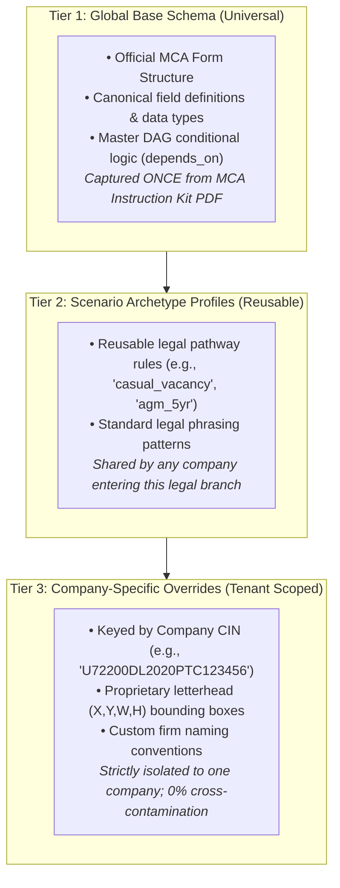
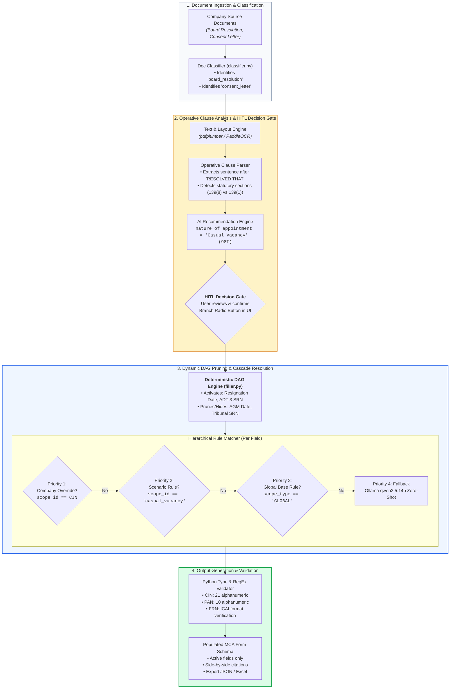

# Comprehensive Technical Specification: Multi-Tenant Hierarchical Extraction & HITL Decision Architecture

**Module:** IDP Studio & Dynamic Extractor Engine (`automation_engine/modules/idp_studio`)  
**Target Forms:** 54+ MCA Form Schemas (e.g., ADT-1, AOC-4, MGT-7, Form 8) & RBI FLA  
**Date:** September 2026  
**Status:** Approved Architecture Specification  

---

## 1. Problem Diagnosis: The "Flat Mapping" Limitation

### 1.1 The Existing Architecture Flaw
In the original design, mapping rules were stored with a flat scope:
$$\text{Rule} = f(\text{template\_name}, \text{document\_type}, \text{form\_field})$$

```text
Table: idp_schema_alias_rules (BEFORE)
├── rule_id: "rule_123"
├── template_name: "ADT-1"
├── document_type: "board_resolution"
├── form_field: "nature_of_appointment"
└── extracted_key: "Casual Vacancy"
```

### 1.2 Why Flat Scoping Fails Across 50+ Companies
When 50 different companies file the same MCA form (e.g., **Form ADT-1**), they differ across two fundamental axes:
1. **Statutory Legal Pathways (Mutual Exclusivity):**
   * *Company A:* Appointing statutory auditor in an AGM for a 5-year block (Sec 139(1)).
   * *Company B:* Casual vacancy due to auditor resignation (Sec 139(8) - requires SRN of ADT-3).
   * *Company C:* Casual vacancy due to death of auditor (Sec 139(8) - death certificate required, no ADT-3).
   * *Company D:* Tribunal / Court Order appointment (Sec 140(5) - requires INC-28).
   * *Company E:* Joint Auditors (two separate firms).
2. **Document Drafting & Layout Variance:**
   * Secretarial firm A formats the resolution as a standard 1-page extract with specific tabular coordinates.
   * Secretarial firm B uses a 4-page narrative paragraph format on printed company letterhead.

**The Failure Mode:** If Company B saves a mapping rule stating that `nature_of_appointment` maps to `"Casual Vacancy"` or maps a specific coordinate for `ADT-3 SRN`, that rule becomes **globally active for "ADT-1"**. When Company A (an AGM appointment) subsequently runs extraction, Company B's rule pollutes Company A's filing, activating invalid fields and causing statutory rejection by the Ministry of Corporate Affairs (MCA).

---

## 2. The Architectural Solution: 3-Tier Hierarchical Cascade

To guarantee **zero cross-contamination** while preserving **maximum reusability**, the engine adopts a **3-Tier Scoped Inheritance Model** combined with an **Upfront Human-in-the-Loop (HITL) Decision Gate**.

### 2.1 The 3 Tiers of Knowledge



---

## 3. End-to-End System Pipeline & Connection Topology



---

## 4. Exact Technical Changes (What We Are Modifying & Implementing)

### 4.1 Database Layer (`automation_engine/modules/idp_studio/core/`)

#### A. Database Schema Enhancement (`core/models.py`)
Add `scope_type`, `scope_id`, and `priority` columns to `idp_schema_alias_rules` and `idp_dom_extraction_rules`:

```diff
 class SchemaAliasRule(Base):
     __tablename__ = "idp_schema_alias_rules"
 
     rule_id = Column(String, primary_key=True, index=True)
     template_name = Column(String, index=True) # e.g. "ADT-1"
+    scope_type = Column(String, index=True, default="GLOBAL") # "GLOBAL" | "SCENARIO" | "COMPANY"
+    scope_id = Column(String, index=True, default="default")   # "default" | "casual_vacancy" | CIN
+    priority = Column(Integer, default=1)                     # 1 = Global, 2 = Scenario, 3 = Company
     document_type = Column(String, index=True, default="generic", nullable=True)
     form_field = Column(String, index=True)
     extracted_key = Column(String)
     spatial_meta_json = Column(Text, nullable=True)
```

#### B. Zero-Touch Database Migration (`core/db.py`)
In `init_db()`, check if the new columns exist via `PRAGMA table_info`. If missing, execute non-destructive `ALTER TABLE` statements:
```python
# Safe SQLite schema migration
for tbl in ["idp_schema_alias_rules", "idp_dom_extraction_rules"]:
    cols = [r[1] for r in conn.execute(text(f"PRAGMA table_info({tbl})")).fetchall()]
    if "scope_type" not in cols:
        conn.execute(text(f"ALTER TABLE {tbl} ADD COLUMN scope_type VARCHAR DEFAULT 'GLOBAL'"))
    if "scope_id" not in cols:
        conn.execute(text(f"ALTER TABLE {tbl} ADD COLUMN scope_id VARCHAR DEFAULT 'default'"))
    if "priority" not in cols:
        conn.execute(text(f"ALTER TABLE {tbl} ADD COLUMN priority INTEGER DEFAULT 1"))
```
*Existing records automatically receive `scope_type='GLOBAL'` and `priority=1`, maintaining 100% backward compatibility.*

---

### 4.2 Extraction Engine Layer (`automation_engine/modules/idp_studio/`)

#### A. Operative Clause Detector (`extractors/classifier.py`)
Implement the legal clause parser that isolates the operative sentence following `"RESOLVED THAT"`:
```python
def detect_operative_statutory_branch(text: str) -> Dict[str, Any]:
    """
    Extracts the statutory appointment branch from the operative clause.
    Precedence: Section 140(5) > Section 139(5) > Section 139(8) > Section 139(1)
    """
    match = re.search(r"RESOLVED\s+THAT.*?(?=RESOLVED\s+FURTHER|\.\s+[A-Z]|\Z)", text, re.DOTALL | re.IGNORECASE)
    clause = match.group(0) if match else text
    
    if re.search(r"139\s*\(\s*8\s*\)|casual\s+vacancy", clause, re.IGNORECASE):
        reason = "Resignation" if re.search(r"resign", clause, re.IGNORECASE) else "Death"
        return {
            "nature_of_appointment": "Casual Vacancy",
            "casual_vacancy_reason": reason,
            "confidence": 0.98,
            "evidence": clause[:150]
        }
    elif re.search(r"140\s*\(\s*5\s*\)|tribunal|nclt", clause, re.IGNORECASE):
        return {
            "nature_of_appointment": "Auditor appointed by the Tribunal",
            "confidence": 0.95,
            "evidence": clause[:150]
        }
    elif re.search(r"139\s*\(\s*5\s*\)|central\s+government|cag", clause, re.IGNORECASE):
        return {
            "nature_of_appointment": "Auditor appointed by Central Government",
            "confidence": 0.95,
            "evidence": clause[:150]
        }
    else:
        return {
            "nature_of_appointment": "Appointment/ Re-appointment in AGM",
            "confidence": 0.90,
            "evidence": clause[:150]
        }
```

#### B. Hierarchical Rule Resolver (`extractors/spatial.py` & `forms/filler.py`)
Query rules ordered by `priority DESC` and deduplicate per `form_field`:
```python
def get_effective_rules(template_name: str, company_id: Optional[str] = None, scenario: Optional[str] = None):
    db = SessionLocal()
    try:
        query = db.query(SchemaAliasRule).filter(SchemaAliasRule.template_name == template_name)
        # Filter matching scopes
        scope_filters = [SchemaAliasRule.scope_type == "GLOBAL"]
        if scenario:
            scope_filters.append((SchemaAliasRule.scope_type == "SCENARIO") & (SchemaAliasRule.scope_id == scenario))
        if company_id:
            scope_filters.append((SchemaAliasRule.scope_type == "COMPANY") & (SchemaAliasRule.scope_id == company_id))
        
        rules = query.filter(or_(*scope_filters)).order_by(SchemaAliasRule.priority.desc()).all()
        
        # Shadowing deduplication: Highest priority rule per field wins
        effective = {}
        for r in rules:
            if r.form_field not in effective:
                effective[r.form_field] = r
        return effective
    finally:
        db.close()
```

---

### 4.3 API Router Layer (`automation_engine/modules/idp_studio/router.py`)

1. **`POST /api/idp/forms/{form_id}/detect_branch`** *(NEW)*:
   - Takes uploaded document text.
   - Runs `detect_operative_statutory_branch`.
   - Returns `{ "detected_branch": "Casual Vacancy", "options": [...], "evidence": "..." }` for the frontend HITL gate.
2. **`POST /api/idp/forms/{form_id}/autofill`** *(ENHANCED)*:
   - Accepts confirmed `{ "company_id": "...", "scenario": "casual_vacancy", "branch_selections": {...} }`.
   - Executes DAG pruning based on confirmed selections.
   - Extracts active branch values and returns populated form schema.
3. **`POST /api/idp/rules` & `/rules_batch_save`** *(ENHANCED)*:
   - Accepts `scope_type` (`"GLOBAL"`, `"SCENARIO"`, `"COMPANY"`) and `scope_id` (`"default"`, scenario name, or CIN).

---

### 4.4 Frontend UI Layer (`fla_frontend/src/idp_studio/`)

#### HITL Decision Modal (`ExtractionBranchGateModal.jsx`):
When a user uploads documents in the Extractor:
1. System shows a 1-step modal before generating the full form.
2. Radio buttons for `Nature of Appointment` are displayed with the AI recommendation pre-selected.
3. User clicks **"Confirm & Extract"**.
4. In the Field Rule Editor, when an operator saves a corrected mapping, a simple scope selector is provided:
   * `( ) Universal Rule (All Companies)`
   * `( ) Scenario Rule (All Casual Vacancy Filings)`
   * `(●) This Company Only (CIN: U72200DL...)`

---

## 5. Summary Matrix: Before vs. After

| Feature | Before (Flat Design) | After (Hierarchical HITL Design) |
| :--- | :--- | :--- |
| **Rule Collision** | High: Company A's rules overwrote Company B's mappings. | Zero: Company-specific rules are isolated by CIN. |
| **Reusability** | Low: Each company required manually re-mapping fields. | High: Companies under the same scenario share 1 profile. |
| **Branch Selection** | Black-box unguided LLM guess (prone to hallucinations). | Two-pass: AI Operative Clause detection + 1-Click HITL confirmation. |
| **Field Pruning** | All 29 fields queried, even when mutually exclusive. | Strict DAG pruning: Only the 10–12 active branch fields are processed. |
| **Audit Provenance** | None: Hard to know where values originated. | Full: Shows exact line, page, and rule tier (Company, Scenario, Global). |
| **Performance** | High token consumption, slow round-trips. | Fast: 60% fewer LLM tokens used per extraction. |
