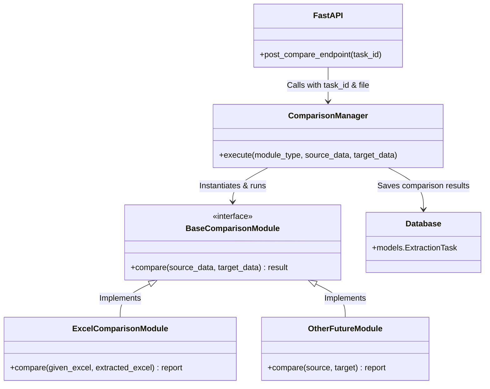

# Comparison Module Implementation Plan

This plan details the creation of a new, scalable comparison module within the FLA AI platform's backend (`fla_automation_engine`). The primary goal is to compare a user-provided ("given") Excel file with the system-generated ("extracted") Excel file.

## Goal Description
Implement an extensible comparison engine that currently supports Excel-to-Excel comparison but is designed to scale, allowing new comparison modules (e.g., PDF-to-Excel, JSON-to-Excel, or semantic comparisons) to be easily plugged in later.

> [!IMPORTANT]
> **User Review Required**: Please review the **Proposed Architecture** and **Open Questions** to ensure the design aligns with your future scalability goals before we begin execution.

## Open Questions
1. **Comparison Strategy**: For the Excel comparison, should the comparison be strict cell-by-cell (e.g., Sheet1!A1 vs Sheet1!A1) or row/column header-based (e.g., looking for a specific entity name regardless of the exact row number)?
2. **Result Storage**: Should the comparison results be stored persistently in the SQLite database, or is it sufficient to return the comparison report directly via the API response for the frontend to display?
3. **Future Modules**: What other specific comparison modules do you envision bringing in later? Knowing this can help us refine the base interfaces.

## Proposed Architecture

We will implement a Strategy Pattern for the comparison engine. This allows us to define a common interface that any future comparison module can implement.

### Visual Architecture

### 1. Engine Architecture (Backend)

We will create a new directory `fla_automation_engine/engine/comparison/`.

#### [NEW] `engine/comparison/base.py`
- Define an abstract base class `BaseComparisonModule`.
- It will enforce a standard `compare(source_data, target_data)` method and return a standardized result format (e.g., lists of matches, mismatches, and missing elements).

#### [NEW] `engine/comparison/excel_compare.py`
- Implement the `ExcelComparisonModule` inheriting from `BaseComparisonModule`.
- Logic to load two Excel files (using `openpyxl` or `pandas`), iterate through specific sheets/cells, and generate a diff report.

#### [NEW] `engine/comparison/manager.py`
- A factory/manager class `ComparisonManager` that dynamically loads the requested comparison module and executes it. This is where we scale by registering future modules.

### 2. API Updates

#### [MODIFY] `api/models.py`
- Update the database schema to store comparison results. We can add a `comparison_results` JSON column to the `ExtractionTask` model, or create a separate `ComparisonReport` model linked to the task.

#### [MODIFY] `api/main.py`
- Add a new endpoint: `POST /api/compare/{task_id}`.
- This endpoint will accept a `given_excel` file upload.
- It will retrieve the `output_excel` associated with the `task_id`.
- It will invoke the `ComparisonManager` with the `ExcelComparisonModule`.
- It will save and return the comparison results to the frontend.

## Verification Plan

### Automated Tests
- Create `test_comparison.py` in the backend tests.
- Provide two dummy Excel files with known differences.
- Assert that the `ExcelComparisonModule` correctly identifies the exact mismatches, missing values, and matches.
- Assert that the `ComparisonManager` correctly routes to the appropriate module.

### Manual Verification
- Start the FastAPI backend and frontend.
- Run an extraction task to generate an `extracted_excel`.
- Upload a modified version of that Excel file through a Swagger UI or API client as the `given_excel`.
- Verify the API response correctly lists the structural or value differences.
