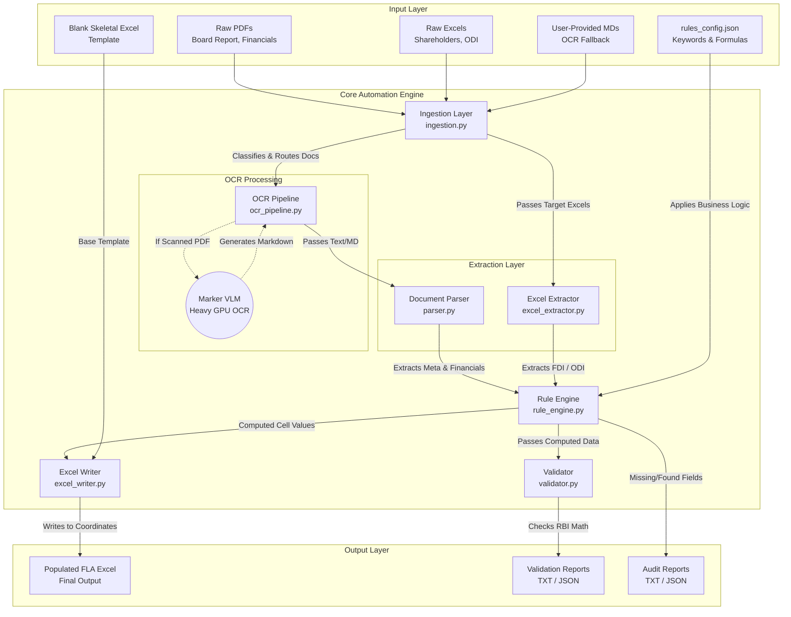

# FLA Return Automation Engine Architecture

This document outlines the current system architecture of the RBI FLA Return Automation Engine.

## High-Level Architecture Diagram

## Component Breakdown

### 1. Input Layer
- **Raw Documents:** The client provides arbitrarily named files (PDFs for reports, Excels for shareholder data).
- **Configuration (`rules_config.json`):** The central brain of the system. It contains keyword aliases for financial metrics, mathematical formulas for derived fields (like Net Worth), and exact Excel coordinate mappings (e.g., `D15`).
- **Skeletal Excel:** A blank, perfectly formatted `.xlsx` file mimicking the RBI portal structure.

### 2. Core Automation Engine
- **Ingestion (`ingestion.py`):** Opens files and scans their contents to dynamically classify them (e.g., identifying a file as `shareholders_fdi` because it has "Name" and "Shares" columns).
- **OCR Pipeline (`ocr_pipeline.py`):** Acts as a bridge between the Python engine and the heavy Machine Learning OCR tool (**Marker**). It handles checking for cached markdown files or triggering the VLM to convert scanned tables into machine-readable text.
- **Extraction (`parser.py` & `excel_extractor.py`):** Uses Regex and fuzzy string matching to pull exact numerical and text values from the raw documents based on the `rules_config.json`.
- **Rule Engine (`rule_engine.py`):** Receives the raw extracted values, scales them (e.g., Absolute $\rightarrow$ Lakhs), evaluates mathematical formulas, and pre-formats them for Excel injection.
- **Excel Writer (`excel_writer.py`):** Uses `openpyxl` to inject the processed dictionary of values directly into the target coordinates of the Skeletal Excel.
- **Validator (`validator.py`):** Re-calculates critical portal logic (like ensuring Total Equity matches the breakdown) and flags discrepancies.

### 3. Output Layer
- **Populated Excel:** The final deliverable ready for RBI upload.
- **Audit/Validation Reports:** Logs detailing exactly what parameters were found, which ones fell back to defaults, and whether the final math passes RBI logic checks.
