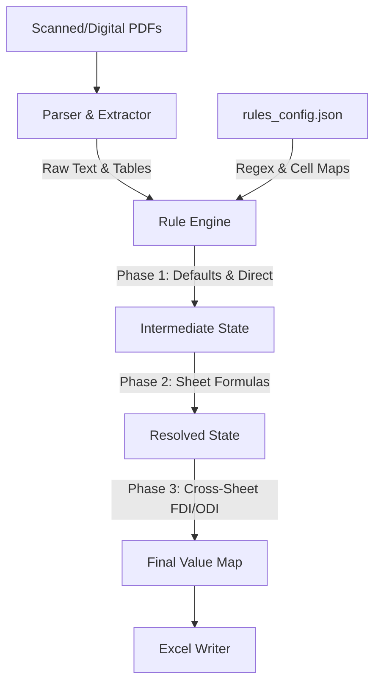

# RBI FLA Return Automation Engine

A scalable, rule-based document-to-Excel automation engine designed to automatically populate the RBI FLA Return target skeletal spreadsheet (`FLA Return existing skeletal.xlsx`) using the business logic, formulas, and unlisted validation structures defined in `FLA_Tool_v5_fixed.xlsx`.

---

## 1. Engine Directory Structure

The engine is structured as a modular Python package to allow independent modifications or enhancements to any layer (such as replacing the OCR engine or refining parsing regex):

```text
/Users/apple/Desktop/FLA/
├── README.md                 # Project guide and instructions
├── requirements.txt          # Python dependencies
├── rules_config.json         # Decoupled rules, cell coordinates, and defaults
├── run_pipeline.py           # Main pipeline entry-point script
├── engine/                   # Modular automation engine core
│   ├── __init__.py           # Package marker
│   ├── ingestion.py          # Scans folders and classifies PDFs (digital/scanned)
│   ├── ocr_pipeline.py       # Interfaces with VLM OCR and caches JSON/MD outputs
│   ├── parser.py             # Parses text segments and structured Markdown tables
│   ├── rule_engine.py        # Evaluates applicability conditions and formulas
│   ├── excel_writer.py       # Writes computed metrics to exact sheet coordinates
│   └── validator.py          # Performs mathematical validations & generates audits
└── signed/                   # Folder containing source signed PDF documents
```

---

## 2. Dynamic Rules Mapping (`rules_config.json`)

To prevent hardcoded layout structures in Python, the file `rules_config.json` stores all rules, keywords, regex patterns, validation limits, and cell coordinates.
* **`company_extraction_rules`**: Contains keywords and patterns for CIN, PAN, Email, Mobile, and Names.
* **`financial_extraction_rules`**: Contains column and row headers for Balances, PBT/PAT, Sales, Purchases, and Headcounts.
* **`cell_mappings`**: Connects cell targets (`Section I` through `Section IV`) to either `"extracted"` PDF fields or `"calculated"` mathematical formulas.

---

## 3. Server Setup & Installation Guide

To run this pipeline on your server, follow these installation steps:

### Step 1: Install Python Dependencies
```bash
pip install -r requirements.txt
```

### Step 2: Install Marker OCR (For Scanned PDFs)
If your signed financials are scanned image-only PDFs, you will need the VLM OCR framework:
```bash
pip install marker-pdf
```
*Note: The first run of Marker will automatically download its layout and segmentation models (approx. 2-3GB).*

### Step 3: Run the API Server
To start the backend FastAPI server, run the following command from the `fla_automation_engine` directory:
```bash
python -m uvicorn api.main:app --host 0.0.0.0 --port 8000 --reload
```

---

## 4. How to Run the Pipeline

Simply run the master pipeline script from the root workspace directory.

### Standard Run (Reuses Cached OCR / Digital Extraction)
This runs the pipeline natively, extracting digital text from the Board Report, checking cached OCR outputs, executing the formula engine, updating the target sheet, and auditing the result:
```bash
python3 run_pipeline.py \
  --input-dir signed \
  --skeletal excel/FLA\ Return\ existing\ skeletal.xlsx \
  --output excel/FLA\ Return\ Populated.xlsx
```

### Running the Pipeline for Kritilabs (OCR Cached Output)
To run the pipeline using the pre-scanned VLM OCR markdown output and digital Board Report for **Kritilabs Technologies Private Limited**:
```bash
python3 run_pipeline.py \
  --input-dir "/Users/apple/Desktop/FLA/kiritlabs/Signed" \
  --ocr-dir "/Users/apple/Desktop/FLA/fla_automation_engine/output/marker/kiritlabs" \
  --output "/Users/apple/Desktop/FLA/output/kiritlabs/FLA Return Populated.xlsx"
```

### Option A: Running with a Custom OCR Path / Environment Command
If you have `marker_single` installed in a **different virtual environment** than the rest of the python pipeline (e.g. inside an env that has `_lzma` libraries), you can pass the specific executable command via the `--ocr-cmd` parameter:
```bash
python3 run_pipeline.py --ocr-cmd /path/to/another_env/bin/marker_single
```

### Option B: Pre-generating OCR Results Manually (Completely Skips Subprocess Calls)
If you prefer to run the OCR manually on your server first using your own custom script or command, simply direct its output directory to the standard destination:
`fla_automation_engine/output/marker/{PDF_BASE_NAME}/{PDF_BASE_NAME}.json`

When you execute the master pipeline (`python3 run_pipeline.py`), the pipeline will:
1. Natively detect the pre-generated `.json` and `.md` outputs inside the cache.
2. Print `[*] Found cached Marker OCR results for ...`.
3. **Completely skip calling `marker_single` entirely**, proceeding directly to parsing and populating the Excel file!

### Force OCR Processing Run
If you have new scanned PDFs and want to force a fresh VLM OCR parse of the financial sheets:
```bash
python3 run_pipeline.py --force-ocr
```

---

## 5. Output and Audit Reports

Upon successful execution, the engine produces three main files in the workspace:
1. **`excel/FLA Return Populated.xlsx`**: The final RBI FLA Return template fully populated with exact cell values (preserving all fonts, borders, formats, and non-target cells).
2. **`validation_report.json`**: Structured audit log containing status (`PASSED`/`FAILED`) and exact equations for every integrity check.
3. **`validation_report.txt`**: A clean, human-readable consistency report matching the `4_VALIDATION` sheet checks.

---

## 6. Mapping System & Rule Engine Deep-Dive

The automation engine's intelligence is decoupled into **two primary layers** to achieve clean segregation of configuration and calculation:



### A. Centralized Schema & Mappings (`rules_config.json`)
To prevent hardcoding layouts in Python, all layouts are stored in a configuration dictionary:
* **Company Regexes:** Defines keywords and regular expressions for entity profiles. For instance, the **CIN** regex:
  `[UuLl][0-9]{5}[A-Za-z]{2}[0-9]{4}[A-Za-z]{3}[0-9]{6}`
  captures the 21-digit Indian Corporate Identity Number (detecting Private Limited `PTC` and Public Limited `PLC` classes) to extract `U72900TN2022PTC154202`.
* **Field Configurations:** Mapped fields either use:
  * `"type": "extracted"`: Linked to document parsed keys (`field`) with an optional fallback `"default"` (e.g. `PAN_Number` defaults to `AAJCT5635Q`).
  * `"type": "calculated"`: Linked to mathematical equations resolved dynamically at runtime.

### B. Phase-by-Phase Calculation Architecture (`rule_engine.py`)
At execution, the `RuleEngine` consumes the config dictionary and processes the database in **three sequential phases**:

#### 🔄 Phase 1: Direct Mappings, Conversions & Defaults
1. Evaluates all `"type": "extracted"` mappings. Takes the extracted VLM table/regex value or falls back to the configured `"default"`.
2. Converts raw share numbers and face values into RBI's standard currency unit (INR Lakhs):
   $$\text{INR Lakhs} = \frac{\text{Share Count} \times \text{Face Value}}{100,000}$$

#### 🧮 Phase 2: Resolving Dynamic Accounting Formulas
Resolves intermediate sheet cell dependencies representing standard portal accounting equations:
* **Capital Summation:** `Paid-Up Capital (F5)` = `Equity Capital (F6)` + `Non-Participating Preference Capital (F9)`.
* **Non-Resident Shareholding Percentage:** Sums foreign classes `F12` through `F22` to get `F11` (Total NR Capital) and computes:
  $$\text{NR Shareholding \% (F24)} = \frac{\text{Total NR Capital (F11)}}{\text{Total Equity \& Part. Pref (F6)}} \times 100\%$$
* **Net Worth:** `Net Worth (F34)` = `Paid-Up Equity Capital (F6)` + `Reserves & Surplus (F32)`.
* **Retained Profit:** `Retained Profit (F30)` = `Profit After Tax (F27)` - `Dividends Paid (F28)`.

#### 🌍 Phase 3: Cross-Sheet FDI & ODI Valuations
Computes transnational valuations spanning multiple worksheet tabs:
* **Section III (Foreign Direct Investment - FDI):**
  Resolves parent company holdings dynamically by multiplying ownership percentages with the calculated domestic Net Worth:
  $$\text{FDI Capital PY (D20)} = \frac{\text{FDI Investor \% (D16)}}{100} \times \text{Company Net Worth PY (F34)}$$
  $$\text{FDI Other Capital (D23)} = \text{Other Liabilities (D24)} - \text{Other Claims (D25)}$$
* **Section IV (Overseas Direct Investment - ODI):**
  Computes foreign net worths and converts foreign holdings into INR Lakhs using closing exchange rates:
  $$\text{DIE Net Worth (D30)} = \text{DIE Equity Capital (D26)} + \text{Reserves & Surplus (D28)}$$
  $$\text{DIE Equity INR Lakhs (D39)} = \frac{\text{DIE Equity held (Foreign Currency) (D27)} \times \text{Exchange Rate (D31)}}{100,000}$$

### C. Layout Coordinate Re-alignments (The Header Mismatches Solved)
Because the RBI templates contain multiple pages of introductory instructions and multi-row header legends, we re-aligned several coordinates in `rules_config.json` to match the exact visual entry locations:
1. **Section II Employee Counts:** Moved from `F43`/`G43` (financial amount columns) to **`D43`/`E43`** (physical headcount columns).
2. **Section III FDI 1 Details:** Shifted down from the header rows 15 & 16 to the actual input row:
   * Investor Name: **`B17`**
   * Country of Investor: **`C17`**
   * Equity Percentage PY & FY: **`D17`** & **`E17`**
3. **Section IV ODI 1 Details:** Shifted down from the header rows to the actual input row:
   * Enterprise Name: **`A19`**
   * Country of DIE: **`D19`**
   * Equity Percentage PY & FY: **`E19`** & **`F19`**
   * Reported Foreign Currency: **`D25`** (moves from label block `C25`).
