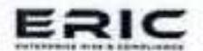

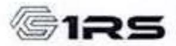

(A subsidiary of 1st Risk Solutions, UK) : U74999TN2019PTC130140 GST : 33AAFCE5406Q1ZF

#### **Board's Report**

To

The Members of

ERIC RISK MANAGEMENT SOLUTIONS PRIVATE LIMITED

Your Directors hereby present the 6th Annual Report of your Company together with the Audited Statement of Accounts and the Auditors' Report of your company for the financial year ended 31st March 2025.

## **FINANCIAL HIGHLIGHTS**

The financial performance of your company for the year ending March 31, 2025 is summarized below:

(Amount in Thousands)

| Particulars                    | 2024-25 | 2023-24 |
|--------------------------------|---------|---------|
| Gross Income                   | 5334.64 | 4013.55 |
| Expenditures                   | 5167.56 | 3833.56 |
| Net Profit before Tax          | 167.08  | 179.99  |
| Tax: Current tax               | 29.20   | 31.17   |
| Deferred Tax Income/ (Expense) | 5.46    | -5.21   |
| Net Profit (Loss) after Tax    | 143.34  | 48.44   |

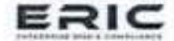

(A subsidiary of 1st Risk Solutions, UK)

L/34999TN2019PTC130140 GST : 33AAFCE5406Q12F

#### 2. **EXTRACT OF ANNUAL RETURN**

As per the provisions of the Companies (Amendment) Act, 2017 notified by the Ministry of Corporate Affairs on 31st July 2018 read with notification dated 28th August 2020 amending the provisions of section 134(3)(a) and section 92(3) of the Companies Act, 2013 respectively, further read with the Companies (Management and Administration) Amendment Rules, 2021 substituting the Rule 12(1) of the Companies (Management and Administration) Rules, 2014, the requirement for preparing an extract of annual return to be made part of Board's Report has been omitted. Accordingly, the extract of the annual return in form MGT-9 is not required to be annexed to the Board's Report. Furthermore, the Company does not have any functional website for the publication of the Annual Return.

#### STATE OF COMPANY'S AFFAIRS AND FUTURE OUTLOOK 3.

The company has earned Net profit of Rs. 1,43,337/- as against the previous year's net profit of Rs. 48,443/-.

#### DIVIDEND

Considering the financial position of the Company, the Board of Directors did not recommend any dividend for the financial year under review.

#### INFORMATION ABOUT SUBSIDIARY/JV/ASSOCIATE COMPANY

Company does not have any Subsidiary, Joint venture or Associate Company.

The Company is a subsidiary of 1st Risk Solutions Limited, UK.

#### NUMBER OF MEETING OF BOARD OF DIRECTORS 6.

During the Financial Year, the Company held 4 Board meetings of the Board of Directors as per Section 173 of Companies Act, 2013 which is summarized below. The provisions of the Companies Act, 2013 were adhered to while considering the time gap between the two meetings.

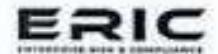

(A subsidiary of 1st Risk Solutions, UK)

: U74999TN2019PTC130140 CIN GST : 33AAFCE5406Q12F

| S. No. | Meeting Date | Board Strength | No of Directors Present |
|--------|--------------|----------------|-------------------------|
| 1      | 06/06/2024   | 2              | 2                       |
| 2      | 05/09/2024   | 2              | 2                       |
| 3      | 16/11/2024   | 2              | 2                       |
| 4      | 31/01/2025   | 2              | 2                       |

#### 7. GENERAL MEETING(S) HELD DURING THE YEAR

During the financial year, following general meetings were held. The provisions of the Companies Act, 2013 were adhered to while conducting the meetings:

| S. No. | Nature of meeting      | Date of Meeting | Total Number of Members as on the date of the meeting | No. of Members Present |
|-----------|------------------------|-----------------|-------------------------------------------------------------|---------------------------|
| 1         | Annual General Meeting | 30/09/2024      | 3                                                           | 3                         |

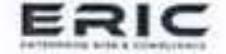

(A subsidiary of 1th Risk Solutions, UK)

: U74999TN2019PTC130140 GST : 33AAFCE5406Q12F

#### 8. DIRECTORS RESPONSIBILITY STATEMENT

Pursuant to Section 134(5) of the Companies Act, 2013 the Board of Directors of the Company confirms that-

- (a) In the preparation of the annual accounts, the applicable accounting standards had been followed along with proper explanation relating to material departures;
- (b) The Directors had selected such accounting policies and applied them consistently and made judgments and estimates that are reasonable and prudent so as to give a true and fair view of the state of affairs of the company at the end of the financial year and of the profit of the company for that period;
- (c) The Directors had taken proper and sufficient care for the maintenance of adequate accounting records in accordance with the provisions of this Act for safeguarding the assets of the company and for preventing and detecting fraud and other irregularities:
- (d) The Directors had prepared the annual accounts on a going concern basis; and
- (e) Company being unlisted sub clause (e) of section 134(5) is not applicable.
- (f) The Directors had devised proper systems to ensure compliance with the provisions of all applicable laws and that such systems were adequate and operating effectively.

#### 9. COMMITTEES OF BOARD

#### Audit Committee

As per the provision of Section 177 along with rules prescribed under the Companies Act, 2013, the company is not required to constitute Audit Committee.

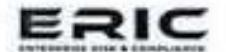

(A subsidiary of 1st Risk Solutions, UK) LUZ4999TN2019PTC130140 GST : 33AAFCES406Q1ZF

#### Nomination and Remuneration Committee

The provisions of Section 178(1) relating to constitution of Nomination and Remuneration Committee are not applicable to the Company and hence the Company has not devised any policy relating to appointment of Directors, payment of Managerial remuneration, Directors qualifications, positive attributes, independence of Directors and other related matters as provided under Section 178(3) of the Companies Act, 2013.

#### **AUDITORS & THEIR REPORT** 10.

#### (A) STATUTORY AUDITORS & THEIR REPORT

M/s. VLN & Associates, Chartered Accountants (Firm Registration No. 011488S) were appointed as Statutory Auditors for a period of 5 years in the Annual General Meeting held on 16/12/2020 for a period of 5 years. The period of office of M/s. VLN & Associates, Chartered Accountants (Firm Registration No. 011488S) expires at the conclusion of the ensuing Annual General Meeting.

It is proposed to appoint M/s. Sreevathson V Associates, Chartered Accountants (Firm Registration No. 008678S) as Statutory Auditor of the Company for a period of 5 years to hold office from the conclusion of this Annual General Meeting till the conclusion of the 11th Annual General Meeting subject to the approval of shareholders.

The Company has received eligibility certificate cum consent letter from M/s. Sreevathson V Associates, Chartered Accountants to the effect that their appointment, if made, would be in accordance with limits specified under section 141 of the Companies Act, 2013.

There are no observations (including any qualification, reservation, adverse remark or disclaimer) of the Auditors in their Audit Report that may call for any explanation from the Directors. Further, the notes to accounts referred to in the Auditor's Report are selfexplanatory.

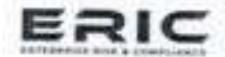

(A subsidiary of 1" Risk Solutions, UK) : U74990TN2019FTC130140

#### (B) SECRETARIAL AUDITOR

The Secretarial Audit is not applicable to the company as it is not covered under the provisions of Section 204 of the Companies Act, 2013 and the Companies (Appointment and Remuneration of Managerial Personnel) Rules, 2014.

#### (C) INTERNAL AUDITOR

Pursuant to Section 138 of the Companies Act, 2013, read with Rule 13 of the Companies (Accounts) Rules, 2014, the provisions for the appointment of an Internal Auditor are applicable to certain classes of companies. Since the Company does not fall under the criteria specified in the aforementioned section and rules, the requirement for appointing an Internal Auditor is not applicable to the Company for the financial year under review.

#### (D) COST AUDITOR

The Cost Audit pursuant to section 148 of the Companies Act, 2013 read with Companies (Cost Records and Audit) Rules, 2014 is not applicable to the company.

#### 11. PARTICULARS OF LOANS, GUARANTEES AND INVESTMENTS

There were no loans, guarantees, or investments made by the Company under Section 186 of the Companies Act, 2013 during the year under review and hence the said provision is not applicable.

#### TRANSFER TO RESERVES IN TERMS OF SECTION 134 (3) (J) OF THE COMPANIES ACT, 12. 2013

The company has not transferred any amounts in the Reserves in terms of Section 134(3)(J) of the Companies Act, 2013.

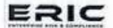

(A subsidiary of 1st Risk Solutions, UK) : U74999TN2019PFC130140 GST : 33AAFGE5409Q12F

#### 13. DISCLOSURE OF STATEMENT ON DECLARATION GIVEN BY INDEPENDENT DIRECTORS U/S 149(6)

The company does not require to appoint Independent Directors, hence the same clause is not applicable.

### 14. RELATED PARTY TRANSACTIONS

The details of the Related Parties Transactions entered into by the Company during the financial year under review are given under Note No. 2. L of Summary of Significant accounting policies of the Financial Statement.

The details of material Related Party Transactions are given in Annexure I to this Report (Refer Annexure I)

#### 15. CONSERVATION OF ENERGY, TECHNOLOGY ABSORPTION AND FOREIGN EXCHANGE EARNINGS

# (A) CONSERVATION OF ENERGY:

| <ul><li>(i) Steps taken or impact on conservation of energy;</li></ul>                           | Your company's operations are not energy intensive. However, adequate measures are always taken to ensure optimum utilization and conservation of energy |
|------------------------------------------------------------------------------------------------------|----------------------------------------------------------------------------------------------------------------------------------------------------------|
| (ii) Steps taken by the company for utilizing alternate sources of energy including waste generated: |                                                                                                                                                          |
| (iii) Capital investment on energy conservation equipment:                                           | NII                                                                                                                                                      |

# (B) TECHNOLOGY ABSORPTION: NOT APPLICABLE

| <ul> <li>(i) the efforts, in brief, made towards technology absorption:</li> </ul>                                                                         | The Company strives to implement the latest available technologies in its operations. |  |
|----------------------------------------------------------------------------------------------------------------------------------------------------------------|---------------------------------------------------------------------------------------|--|
| (ii) the benefits derived as a result of the above efforts, e.g., product improvement, cost reduction, product development, import substitution, etc. |                                                                                       |  |

thitps://www.fra.io/ islaccounta@reactech.io https://www.ficisethr.com/socraeny/fid.reac-solutions

Registered Office: If Floor, Mint - The Reserve, 23, Or. VSI Estate Phase II, Thiruvanniyur, Chennai - 600041,

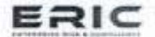

(A subsidiary of 1st Risk Solutions, UK)

: U74999TN2019PTC130140 GST : 33AAFCE5406Q12F

| (iii) in case of imported technology (imported during the last 3 years reckoned from the beginning of the financial year), following information may be furnished: | Nil |
|-----------------------------------------------------------------------------------------------------------------------------------------------------------------------------|-----|
| (a) the details of technology imported:                                                                                                                                     |     |
| (b) the year of import:                                                                                                                                                     |     |
| (c) whether the technology been fully absorbed:                                                                                                                             |     |
| (d) if not fully absorbed, areas where absorption has not taken place, and the reasons thereof:                                                                       |     |
| (iv) the expenditure incurred on research and development:                                                                                                                  | Nil |

## (C) FOREIGN EXCHANGE EARNINGS AND OUTGO

The details of foreign exchange earnings and outgo during the year under review are given under Note No.2.K of Summary of significant accounting policies of the Financial Statement.

| Foreign inflow  | 53,11,190 |  |
|-----------------|-----------|--|
| Foreign outflow | NII       |  |

#### 16. RISK MANAGEMENT POLICY

The Board of Directors of the Company has approved a Risk Management Policy and the Company has implemented various risk management practices as part of its business process.

The Risk Management Policy of the Company is enclosed as Annexure II

### 17. DETAILS OF DIFFERENCE IN VALUATION

The company was not required to give details of the difference in valuation since it is not applicable to the Company for the financial year under review.

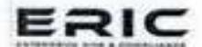

(A subsidiary of 1st Risk Solutions, UK) L U74995TN2019PTC130140 GST : 35AAFGE5406Q1ZF

## 18. SIGNIFICANT AND MATERIAL ORDERS PASSED BY THE REGULATORS OR COURTS

There are no significant material orders passed by the Regulators / Courts which would impact the going concern status of the Company and its future operations.

#### 19. BOARD EVALUATION

The provision of section 134(3) (p) relating to Board evaluation is not applicable to the company.

# 20. STATEMENT REGARDING COMPLIANCES OF APPLICABLE SECRETARIAL STANDARDS

The Company has duly complied with the applicable Secretarial Standards.

#### 21. SHARE CAPITAL

#### A. AUTHORISED CAPITAL

During the year under review, there has been no change in the authorized share capital of the company.

The authorized share capital as on March 31 2025 is as follows:

| S. No. | Type of Share | No. of Shares | Value per share (in Rs.) | Total Amount (in Rupees) |
|-----------|---------------|---------------|-----------------------------|-----------------------------|
| 1         | Equity Shares | 1,50,000      | 10                          | 15,00,000                   |
|           |               |               | Total                       | 15,00,000                   |

#### B. PAID UP CAPITAL

During the year under review, there has been no change in the paid up share capital of the company.

(A subsidiary of 1" Risk Solutions, UK) U74999TN2019PTC130140 GST : 33AAFGE5406Q12F

The paid-up share capital as on March 31, 2025 is as follows:

| S. No. | Type of Share | No. of Shares | Value per share (in Rs.) | Total Amount (in Rupees) |
|-----------|---------------|---------------|--------------------------|-----------------------------|
| 1         | Equity Shares | 1,31,000      | 10                       | 13,10,000                   |
|           |               |               | Total                    | 13,10,000                   |

#### C. BUY BACK OF SECURITIES

The Company has not bought back any of its securities during the year under review.

#### D. SWEAT EQUITY

The Company has not issued any Sweat Equity Shares during the year under review.

#### E. BONUS SHARES

No Bonus Shares were issued during the year under review.

#### F. EMPLOYEES STOCK OPTION PLAN

The Company has not provided any Stock Option Scheme to the employees.

#### G. SHARES WITH DIFFERENTIAL RIGHTS

The Company has not issued any shares with differential rights during the year under review.

#### DIRECTORS AND KEY MANAGERIAL PERSONNEL 22.

There has been no Change in the constitution of Board during the year.

Composition of Board of Directors as on 31/03/2025 is as following:

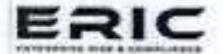

(A subsidiary of 1st Risk Solutions, UK)

CIN : U74999TN2019PTC130140 GST : 33AAFGE5406Q1ZF

| Name                            | Designation                                | DIN                                                         | Date of Appointment                                                           |
|---------------------------------|--------------------------------------------|-------------------------------------------------------------|-------------------------------------------------------------------------------|
| Ms. Nirmala Varadarajan         | Director                                   | 08492596                                                    | 25/06/2019                                                                    |
| Mr.Venkataraman Varadharajan | Director                                   | 08492597                                                    | 25/06/2019                                                                    |
|                                 | Ms. Nirmala Varadarajan Mr.Venkataraman | Ms. Nirmala Varadarajan Director  Mr. Venkataraman Director | Ms. Nirmala Varadarajan Director 08492596  Mr. Venkataraman Director 08492597 |

## 23. DEPOSITS

During the year under review, your Company has not invited any deposits from public/shareholders as per Section 73 of the Companies Act, 2013 read with Companies (Acceptance of Deposits) Rules, 2014.

# 24. CORPORATE SOCIAL RESPONSIBILITIES (CSR)

Therefore, the provisions related to Corporate Social Responsibility are not applicable to the Company.

# 25. DISCLOSURE UNDER THE SEXUAL HARASSMENT OF WOMEN AT WORKPLACE (PREVENTION, PROHIBITION AND REDRESSAL) ACT, 2013

The Company has in place an anti sexual harassment policy in line with the requirements of the sexual harassment of women at the Workplace (Prevention, Prohibition & Redressal) Act, 2013.

Further the company was committed to providing a safe and conducive work environment to its employees during the year under review. Your directors further state that during the year under review, there were no cases filed pursuant to the sexual harassment of women at Workplace (Prevention, Prohibition and Redressal) Act, 2013.

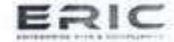

(A subsidiary of 1" Risk Solutions, UK)

IN : U74999TN2019PTC130140 GST : 33AAFCE5406Q12F

Internal Complaints Committee (ICC) has been set up to redress complaints received regarding sexual harassment. All employees (permanent, contractual, temporary, trainees) are covered under this policy.

Summary of sexual harassment complaints received and disposed of during the financial year:

| No. of complaints received:                          | 0 |
|------------------------------------------------------|---|
| No. of complaints disposed of:                       | 0 |
| No. of complaints pending for more than ninety days: | 0 |
| No. of complaints unsolved:                          | 0 |

# 26. INTERNAL FINANCIAL CONTROL SYSTEMS AND THEIR ADEQUACY

The Board has established procedures for ensuring the orderly and efficient conduct of its business including safeguarding of its assets, the prevention and detection of frauds and errors, and the accuracy and completeness of accounting records.

### 27. VIGIL MECHANISM

The Provisions of Vigil Mechanism are not applicable to the company.

#### 28. MAINTENANCE OF COST RECORDS

The provisions relating to maintenance of cost records are not applicable to the Company.

#### 29. CHANGE IN NATURE OF BUSINESS

During the period under review, the Company has not changed its line of business in such a way that amounts to commencement of any new business or discontinuance, sale or disposal of any of its existing businesses or hiving off any segment or division.

#### 30. MATERIAL CHANGES AND COMMITMENTS

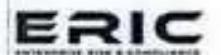

(A subsidiary of 1st Risk Solutions, UK)

CIN : U749997N2019PTC130140

T DBAAFCES409Q1ZF

No material changes and commitments affecting the financial position of the Company had occurred between the end of the financial year to which this financial statement relates, till the date of this report.

### 31. FRAUD REPORTING

There were no fraud reported by the auditor during the year under sub-section (12) of section 143 other than those which are reportable to the Central Government.

## 32. DISCLOSURE UNDER THE MATERNITY BENEFIT (AMENDMENT) ACT, 2017

The provisions of the Maternity Benefit Act, 1961 are not applicable to the Company during the financial year ending 31/03/2025, as the Company does not fall within the thresholds specified under the Act in terms of employee strength or nature of establishment.

# 33. DETAILS OF CORPORATE INSOLVENCY RESOLUTION PROCESS INITIATED UNDER THE INSOLVENCY AND BANKRUPTCY CODE, 2016 (IBC)

No corporate insolvency resolution process is initiated against your Company under Insolvency and Bankruptcy Code, 2016 (IBC).

# 34. NUMBER OF EMPLOYEES AS ON THE CLOSURE OF FINANCIAL YEAR

| Female | 2 | Male | 3 | Transgender | 0 |  |
|--------|---|------|---|-------------|---|--|
|--------|---|------|---|-------------|---|--|

### 35. OTHER DISCLOSURE:

Your Directors confirm that:

 There was no transfer to Investor Education And Protection Fund since there was no unpaid/unclaimed Dividend.

The https://www.htm.io/ Saccounts@misetech.io https://www.linkovin.com/secretory/list-risk.not-mines

Registered Office: Ill Floor, Mint - The Reserve, 23, Dr. VSI Entate Phase II. Tribuvantrigus, Chesnal - 600041.

# ERIC

#### ERIC RISK MANAGEMENT SOLUTIONS PRIVATE LIMITED

(A subjection of 1th Block Schulbers, UK)

LUMBERT SCHOOL STREET SCHOOL STANDARD SCHOOL STANDARD SCHOOL STANDARD SCHOOL STANDARD SCHOOL STANDARD SCHOOL STANDARD SCHOOL STANDARD SCHOOL STANDARD SCHOOL STANDARD SCHOOL STANDARD SCHOOL STANDARD SCHOOL STANDARD SCHOOL STANDARD SCHOOL STANDARD SCHOOL SCHOOL SCHOOL SCHOOL SCHOOL SCHOOL SCHOOL SCHOOL SCHOOL SCHOOL SCHOOL SCHOOL SCHOOL SCHOOL SCHOOL SCHOOL SCHOOL SCHOOL SCHOOL SCHOOL SCHOOL SCHOOL SCHOOL SCHOOL SCHOOL SCHOOL SCHOOL SCHOOL SCHOOL SCHOOL SCHOOL SCHOOL SCHOOL SCHOOL SCHOOL SCHOOL SCHOOL SCHOOL SCHOOL SCHOOL SCHOOL SCHOOL SCHOOL SCHOOL SCHOOL SCHOOL SCHOOL SCHOOL SCHOOL SCHOOL SCHOOL SCHOOL SCHOOL SCHOOL SCHOOL SCHOOL SCHOOL SCHOOL SCHOOL SCHOOL SCHOOL SCHOOL SCHOOL SCHOOL SCHOOL SCHOOL SCHOOL SCHOOL SCHOOL SCHOOL SCHOOL SCHOOL SCHOOL SCHOOL SCHOOL SCHOOL SCHOOL SCHOOL SCHOOL SCHOOL SCHOOL SCHOOL SCHOOL SCHOOL SCHOOL SCHOOL SCHOOL SCHOOL SCHOOL SCHOOL SCHOOL SCHOOL SCHOOL SCHOOL SCHOOL SCHOOL SCHOOL SCHOOL SCHOOL SCHOOL SCHOOL SCHOOL SCHOOL SCHOOL SCHOOL SCHOOL SCHOOL SCHOOL SCHOOL SCHOOL SCHOOL SCHOOL SCHOOL SCHOOL SCHOOL SCHOOL SCHOOL SCHOOL SCHOOL SCHOOL SCHOOL SCHOOL SCHOOL SCHOOL SCHOOL SCHOOL SCHOOL SCHOOL SCHOOL SCHOOL SCHOOL SCHOOL SCHOOL SCHOOL SCHOOL SCHOOL SCHOOL SCHOOL SCHOOL SCHOOL SCHOOL SCHOOL SCHOOL SCHOOL SCHOOL SCHOOL SCHOOL SCHOOL SCHOOL SCHOOL SCHOOL SCHOOL SCHOOL SCHOOL SCHOOL SCHOOL SCHOOL SCHOOL SCHOOL SCHOOL SCHOOL SCHOOL SCHOOL SCHOOL SCHOOL SCHOOL SCHOOL SCHOOL SCHOOL SCHOOL SCHOOL SCHOOL SCHOOL SCHOOL SCHOOL SCHOOL SCHOOL SCHOOL SCHOOL SCHOOL SCHOOL SCHOOL SCHOOL SCHOOL SCHOOL SCHOOL SCHOOL SCHOOL SCHOOL SCHOOL SCHOOL SCHOOL SCHOOL SCHOOL SCHOOL SCHOOL SCHOOL SCHOOL SCHOOL SCHOOL SCHOOL SCHOOL SCHOOL SCHOOL SCHOOL SCHOOL SCHOOL SCHOOL SCHOOL SCHOOL SCHOOL SCHOOL SCHOOL SCHOOL SCHOOL SCHOOL SCHOOL SCHOOL SCHOOL SCHOOL SCHOOL SCHOOL SCHOOL SCHOOL SCHOOL SCHOOL SCHOOL SCHOOL SCHOOL SCHOOL SCHOOL SCHOOL SCHOOL SCHOOL SCHOOL SCHOOL SCHOOL SCHOOL SCHOOL SCHOOL SCHOOL SCHOOL SCHOOL SCHOOL SCHOOL SCHOOL SCHOOL SCHOOL SCHOOL SCHOOL SCHOO

 The information required pursuant to Section 197 read with Rule 5 of The Companies (Appointment and Remuneration of Managerial Personnel) Rules, 2014 in respect of employees of the Company does not apply to this company.

#### 36. ACKNOWLEDGEMENT

Your directors wish to express their grateful appreciation to the continued co-operation received from the banks, government authorities, customers, vendors and shareholders during the year under review. Your directors also wish to place on record their deep sense of appreciation for the committed service of the executives, staff, and workers of the company.

FOR & ON BEHALF OF THE BOARD OF DIRECTORS
ERIC RISK MANAGEMENT SOLUTIONS PRIVATE LIMITED

Nirmala Varadarajan

Neimale

DIN: 08492596

Director

Date: 05/09/2025 Place: Chennai Venkataraman Varadharajan

downharajon.

DIN: 08492597

Director

Date: 05/09/2025 Place: Chennal

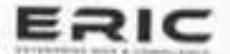

(A subsidiary of 1" Risk Solutions, UK)

CIN U74999TN2619PTC130140 OST : 33AAFCE5406Q12F

# ANNEXURE - I FORM NO. AOC 2

(Pursuant to clause (h) of sub-section (3)of section 134 of the Act and Rule 8(2) of the Companies (Accounts) Rules, 2014)

Form for disclosure of particulars of contracts/arrangements entered into by the company with related parties referred to in sub-section (1) of section 188 of the Companies Act, 2013 including certain arms length transactions under the fourth proviso thereto

- Details of contracts or arrangements or transactions not at arm's length basis NONE 1.
- Details of material contracts or arrangement or transactions at arm's length basis -2. Refer Note No. 2. L of Summary of Significant accounting policies of the Financial Statement.

| Particulars                                                                                                                                                                                                                                                                         | Details                                  |  |
|-------------------------------------------------------------------------------------------------------------------------------------------------------------------------------------------------------------------------------------------------------------------------------------|------------------------------------------|--|
| Corporate identity number (CIN) or foreign company registration number (FCRN) or Limited Liability Partnership number (LLPIN) or Foreign Limited Liability Partnership number (FLLPIN) or Permanent Account Number (PAN)/ Passport for individuals or any other registration number | 09949791                                 |  |
| Name(s) of the related party                                                                                                                                                                                                                                                        | 1st Risk Solutions Limited, UK           |  |
| Nature of relationship                                                                                                                                                                                                                                                              | Shareholder                              |  |
| Nature of contracts/ arrangements/ transactions                                                                                                                                                                                                                                     | Rendering of any services-Sales          |  |
| Duration of the contracts / arrangements/ transactions                                                                                                                                                                                                                              | One year                                 |  |
| Salient terms of the contracts or arrangements or transactions including actual / expected contractual amount                                                                                                                                                                       | Rs. 53,11,190/-                          |  |
| Date of approval by the Board (DD/MM/YYYY)                                                                                                                                                                                                                                          | 05/09/2025                               |  |
| Amount paid as advances, if any                                                                                                                                                                                                                                                     | E-100 (100 (100 (100 (100 (100 (100 (100 |  |

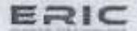

(A subsectory of 1" Risk Solutions, UK)
IN UZ499YF42819F1C1X0189 URT 82XWC814494C1ZF

| Particulars                                                                                                                                                                                                                                                                         | Details                  |
|-------------------------------------------------------------------------------------------------------------------------------------------------------------------------------------------------------------------------------------------------------------------------------------|--------------------------|
| Corporate identity number (CIN) or foreign company registration—number—(FCRN)—or—Limited—Liability Partnership number (LLPIN) or Foreign Limited Liability Partnership—number—(FLLPIN)—or Permanent Account Number (PAN)/ Passport for Individuals or any other registration number | ADWPN1205B               |
| Name(s) of the related party                                                                                                                                                                                                                                                        | Nirmala Varadharajan     |
| Nature of relationship                                                                                                                                                                                                                                                              | Director & Shareholder   |
| Nature of contracts/ arrangements/ transactions                                                                                                                                                                                                                                     | Availing of any services |
| Duration of the contracts / arrangements/ transactions                                                                                                                                                                                                                              | One year                 |
| Salient terms of the contracts or arrangements or transactions including actual / expected contractual amount                                                                                                                                                                 | Rs.12,00,000/-           |
| Date of approval by the Board (DD/MM/YYYY)                                                                                                                                                                                                                                          | 05/09/2025               |
| Amount paid as advances, if any                                                                                                                                                                                                                                                     |                          |

For & on behalf of the Board of Directors

Eric Risk Management Solutions Private Limited

Nirmala Varadarajan

DIN: 08492596

Director

Nur

Date: 05/09/2025 Place: Chennal deroonkarajon

Venkataraman Varadharajan

DIN: 08492597

Director

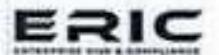

(A subsidiary of 1" Risk Solutions, UK)

CIN : U74999TN2019PTC130140 GST : 33AA/-CES406Q1ZF

## ANNEXURE II - RISK MANAGEMENT POLICY

|                        | Risk Management Policy                                                                                                                                                                                                                                                                                                                                                                             |
|------------------------|----------------------------------------------------------------------------------------------------------------------------------------------------------------------------------------------------------------------------------------------------------------------------------------------------------------------------------------------------------------------------------------------------|
| Policy                 | We are committed to a systematic and comprehensive approach to effective management of potential opportunities and adverse effects, by achieving best practice in the area of risk management.                                                                                                                                                                                                     |
| Philosophy             | The Company embraces intelligent risk taking and recognizes that risks can have both positive and negative consequences.                                                                                                                                                                                                                                                                           |
| Objectives             | Risk management helps us achieve our objectives, operate effectively and efficiently, protect our people and assets, make informed decisions, and comply with applicable laws and regulations.                                                                                                                                                                                                     |
| Business Planning   | Risk Management will be fully integrated with corporate processes at all levels to ensure it is considered in the normal course of business activities.                                                                                                                                                                                                                                            |
| Performance            | The success of our risk management will be measured by its impact on our corporate objectives by audits.                                                                                                                                                                                                                                                                                           |
| Acceptance Criteria | High, Extreme, and/or Strategic risks are controlled through senior management action. Medium risks are assigned specific management responsibility, while Low risks are managed through routine procedures                                                                                                                                                                                        |
|                        | Risk management is a core business skill and integral part of day-to-day activity. As individuals we all play our part in managing risk, and staff at all levels are responsible for understanding and implementing risk management systems in their workplace.                                                                                                                                    |
| Responsibilities       | Managers and leaders at all levels are responsible for applying agreed risk management policy, guidelines, and strategies in their area of responsibility and are expected to ensure risk management is fully integrated with, and considered in the normal course of activities at all levels. Visible commitment requires active participation in risk management processes & effective resource |

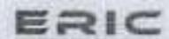

CA subsidiary of 1" Risk Solutions, UK)
WESPERSON OF STANCES AND UZF

allocation.

The Management is responsible for reporting the progress of risks and treatment plans to the Board, reporting strategic or Extreme risks in timely fashion and for ensuring that managers are equipped with necessary skills, guidance and tools

The Board is responsible for the development, coordination, and promulgation of the Risk Management Framework including training and systems that are capable of identifying, monitoring, and reporting, new or emerging risks. The Board is also responsible for review of the Risk Management process, monitoring and reporting key strategic risks.

For & on behalf of the Board of Directors Eric Risk Management Solutions Private Limited

Nirmala Varadarajan DIN: 08492596

Nelma

Director

Date: 05/09/2025 Place: Chennal - Poro amharaja

Venkataraman Varadharajan

DIN: 08492597 Director